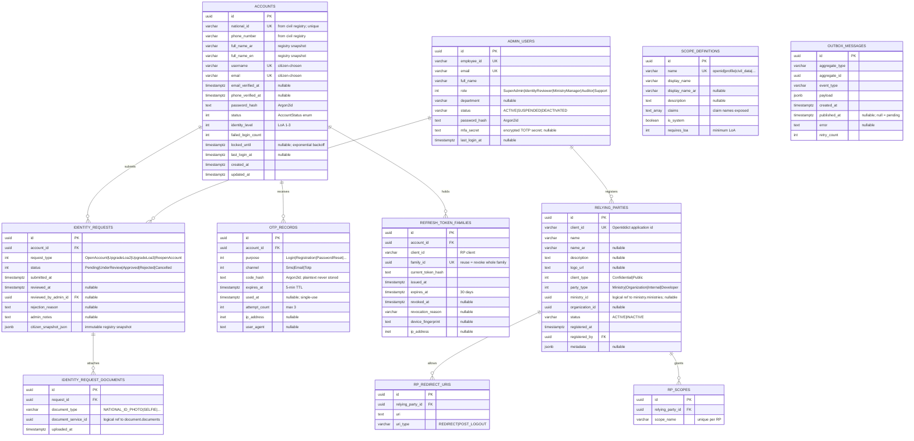
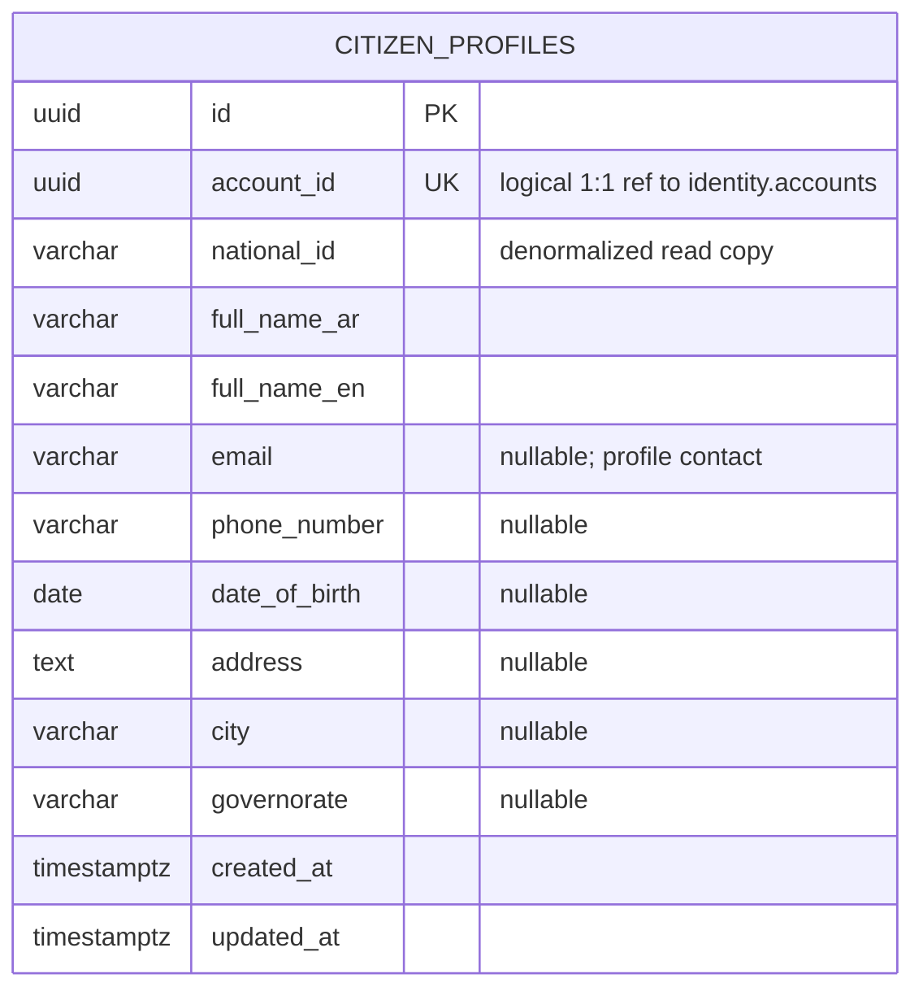
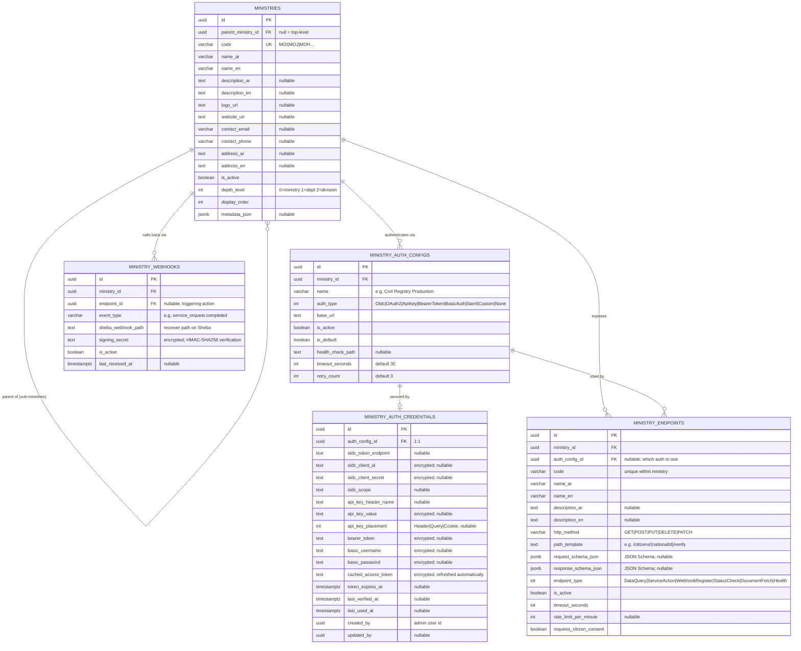
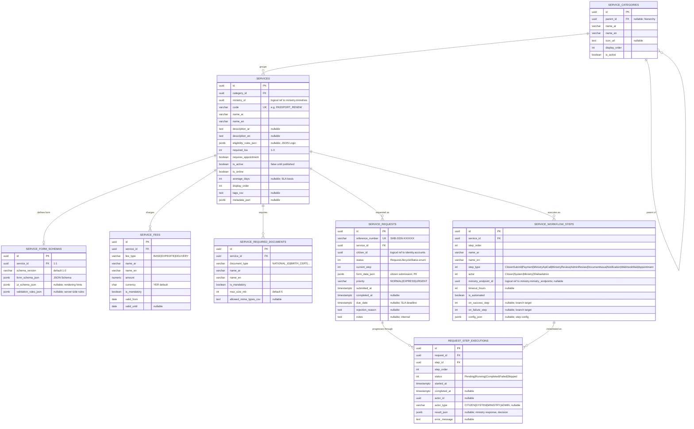
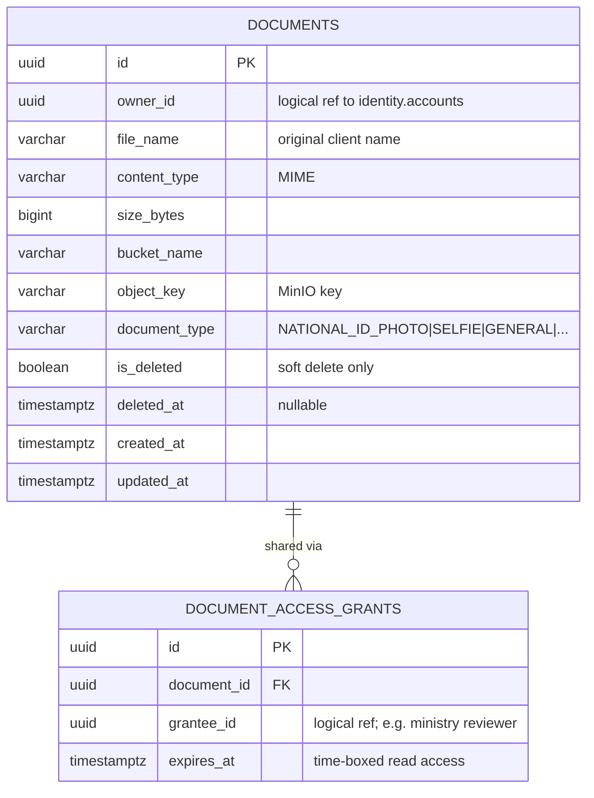
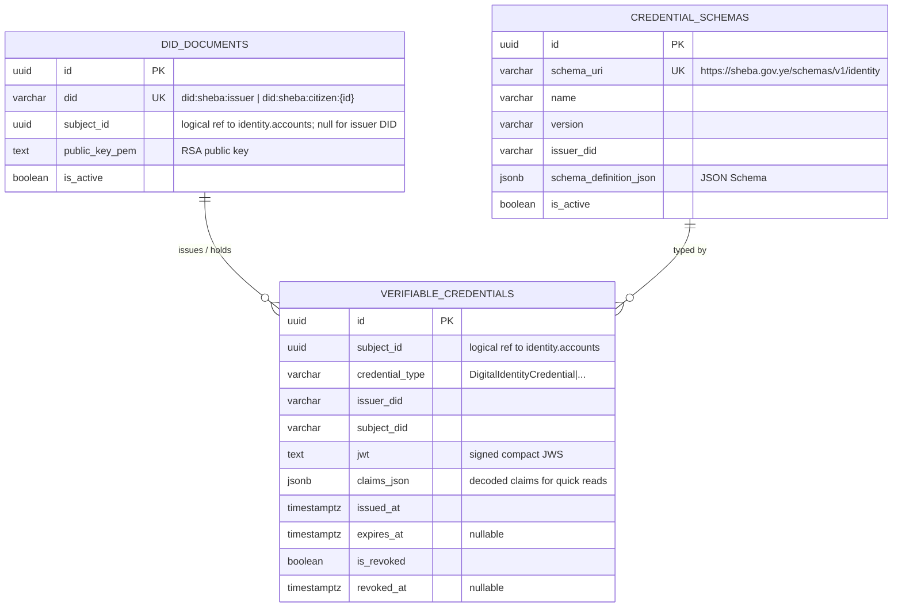
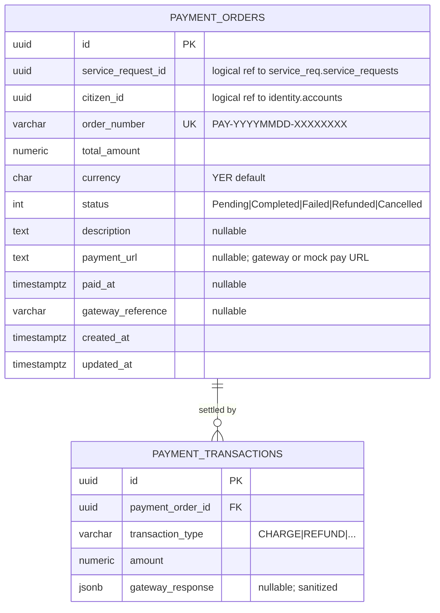
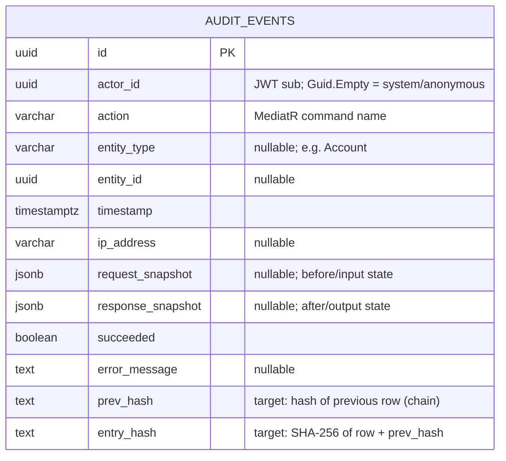
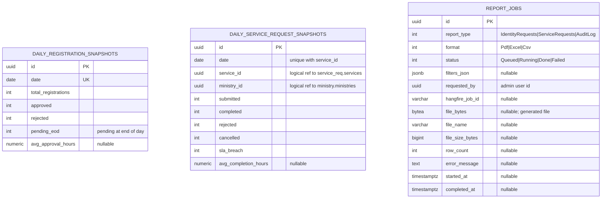

# Database Design

> Extract of [sheba.md](sheba.md) §8; sheba.md wins conflicts. Diagram sources live in
> [diagrams/](diagrams/) as `.mmd` files and are rendered inline below.

## 1. Physical layout

One PostgreSQL 16 database (`sheba`), **one schema per module** — the microservice
database-per-service rule expressed as schemas so extraction is a schema move, not a redesign:

| Schema | Module | Schema | Module |
|--------|--------|--------|--------|
| `identity` | Identity | `wallet` | Wallet |
| `citizen` | Citizen | `payment` | Payment |
| `ministry` | Ministry | `notification` | Notification |
| `service_req` | ServiceRequest | `audit` | Audit |
| `document` | Document | `admin_data` | Admin |

Gateway has no schema. Conventions: UUID PKs (`gen_random_uuid()` semantics via app-side Guids),
`created_at`/`updated_at` timestamptz on every table, snake_case names, enums stored as ints,
JSON payloads as `jsonb` with `_json` suffix.

## 2. Normalization

Write model is 3NF — child tables instead of arrays/CSV for anything queried or constrained
(fees, redirect URIs, scopes, required documents, workflow steps). Justified denormalizations are
listed in [sheba.md §8.1](sheba.md#81-normalization-approach): immutable evidence snapshots,
per-service dynamic form payloads, VC claim read-copies, cross-context read copies, and the BI
read model.

## 3. Cross-context references

**IDs only — no FK constraints, joins, or queries across schemas.** Consistency across contexts is
event-driven with idempotent consumers. Inside a schema, real FKs and unique constraints apply.
Every logical reference is annotated in the ERDs below (`"logical ref to …"`).

## 4. Migrations

EF Core migrations per module, applied independently at startup (`MigrateAllModulesAsync`).
**Current gap:** only Identity has a migrations folder; the other nine contexts use an
`EnsureCreated()` fallback that cannot evolve schemas — closing this is **T-DB-1** in
[TASKS.md](../TASKS.md), scheduled before any real data exists. Rules once closed: never edit an
applied migration; squash only pre-production; `EnsureCreated` banned.

## 5. PII & encryption map

| Table / store | PII / secret | Protection & retention |
|---------------|--------------|------------------------|
| `identity.accounts` | NID, phone, names, email, password hash | Argon2id (password); NID never in tokens (SHA-256 hash claim); volume encryption T-SEC-6. Retained while account exists |
| `identity.identity_requests` | Full registry snapshot (jsonb) | Immutable evidence; purge 10 years after account closure (assumption A3) |
| `identity.otp_records` | OTP hash, IP, UA | Argon2id; purged on use/expiry (Hangfire job) |
| `identity.refresh_token_families` | Token hash, device fingerprint, IP | Hashed tokens only; rows expire with token |
| `ministry.ministry_auth_credentials` | Ministry client secrets, API keys, passwords | **AES-256-GCM** app-level encryption (nonce‖ct‖tag, base64); decrypt only in auth adapters; key-id rotation T-SEC-3 |
| `ministry.ministry_webhooks.signing_secret` | HMAC secrets | Same AES-256-GCM |
| `service_req.service_requests.form_data_json` | Citizen submissions | Ownership-policy access; column encryption T-SEC-7 |
| `document.*` + MinIO objects | KYC images/files | Presigned URLs (short TTL); soft delete; MinIO SSE T-DOC-2 |
| `audit.audit_events` snapshots | Command payloads | Sanitized (no secrets); INSERT-only + hash chain T-AUD-1/2 |
| `notification.notification_records` | Email/phone + message body | Append-only; body templates avoid embedding NIDs |
| Seq logs | — | No-PII logging rule ([coding-standards.md §7](coding-standards.md)) |

> Superseded decision: old ADR-011 prescribed RSA-256/OAEP for credential field encryption.
> RSA-OAEP is a key-wrap primitive (size-limited, unauthenticated for this use); the implemented
> **AES-256-GCM** is correct and is the standard ([sheba.md §7.1](sheba.md#71-data-model)).

## 6. ERDs per bounded context

### 6.1 Identity (`identity`) — [source](diagrams/erd-identity.mmd)

### 6.2 Citizen (`citizen`) — [source](diagrams/erd-citizen.mmd)

### 6.3 Ministry (`ministry`) — [source](diagrams/erd-ministry.mmd)

### 6.4 ServiceRequest (`service_req`) — [source](diagrams/erd-servicerequest.mmd)

### 6.5 Document (`document`) — [source](diagrams/erd-document.mmd)

### 6.6 Wallet (`wallet`) — [source](diagrams/erd-wallet.mmd)

### 6.7 Payment (`payment`) — [source](diagrams/erd-payment.mmd)

### 6.8 Notification (`notification`) — [source](diagrams/erd-notification.mmd)

```mermaid
erDiagram
    NOTIFICATION_TEMPLATES ||--o{ NOTIFICATION_RECORDS : "rendered as (planned)"

    NOTIFICATION_RECORDS {
        uuid id PK
        uuid recipient_id "logical ref to identity.accounts"
        varchar channel "Email|Sms"
        varchar recipient "email address or phone"
        varchar subject "email subject or SMS tag"
        text body
        boolean succeeded
        text error_message "nullable"
        timestamptz sent_at "immutable once written"
    }

    NOTIFICATION_TEMPLATES {
        uuid id PK
        varchar code UK "IDENTITY_APPROVED|OTP_LOGIN|... (planned)"
        varchar channel "Email|Sms|Push"
        varchar subject_template
        text body_template_ar
        text body_template_en
        boolean is_active
    }
```

### 6.9 Audit (`audit`) — [source](diagrams/erd-audit.mmd)

Target hardening (T-AUD-1..3): INSERT-only grant for the app role, SHA-256 hash chain
(`entry_hash = H(row ‖ prev_hash)` — any rewrite breaks the chain), monthly partitioning.

### 6.10 Admin (`admin_data`) — [source](diagrams/erd-admin.mmd)

Written only by event handlers / Hangfire, never by API command handlers
([sheba.md §12](sheba.md#12-dashboard--bi--reporting-backend)).

## 7. Indexing baseline

Unique: every `UK` above. Hot paths: `otp_records(account_id, purpose, expires_at)`,
`identity_requests(status, submitted_at)`, `service_requests(citizen_id, status)`,
`service_requests(reference_number)`, `outbox_messages(published_at) WHERE published_at IS NULL`
(partial), `audit_events(entity_type, entity_id)`, `audit_events(timestamp)`. Add indexes with
migrations, justified by a query — not speculatively.
