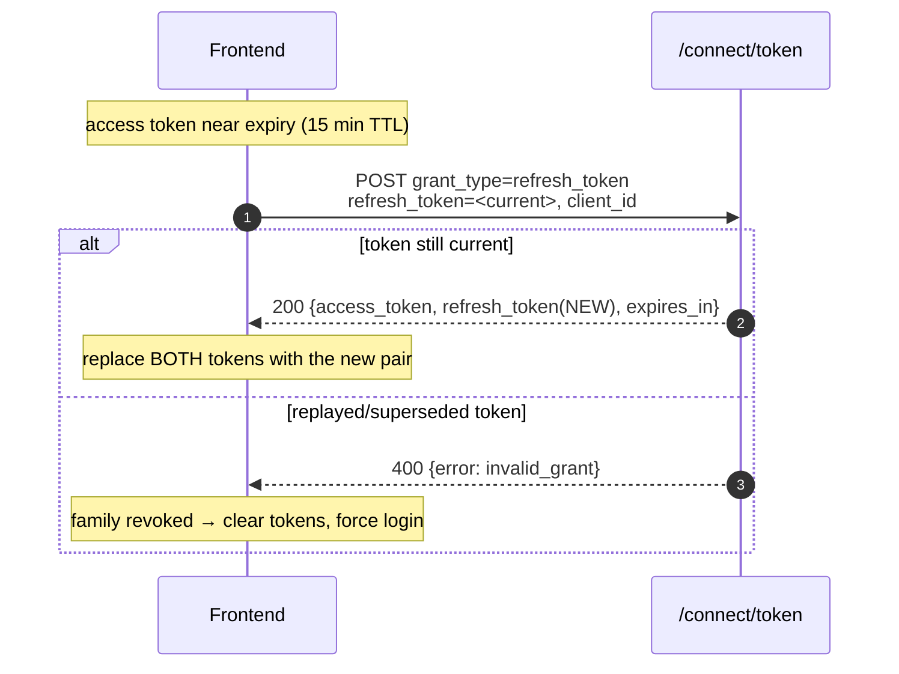
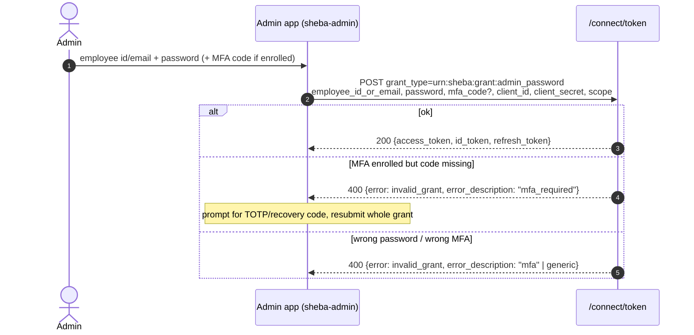
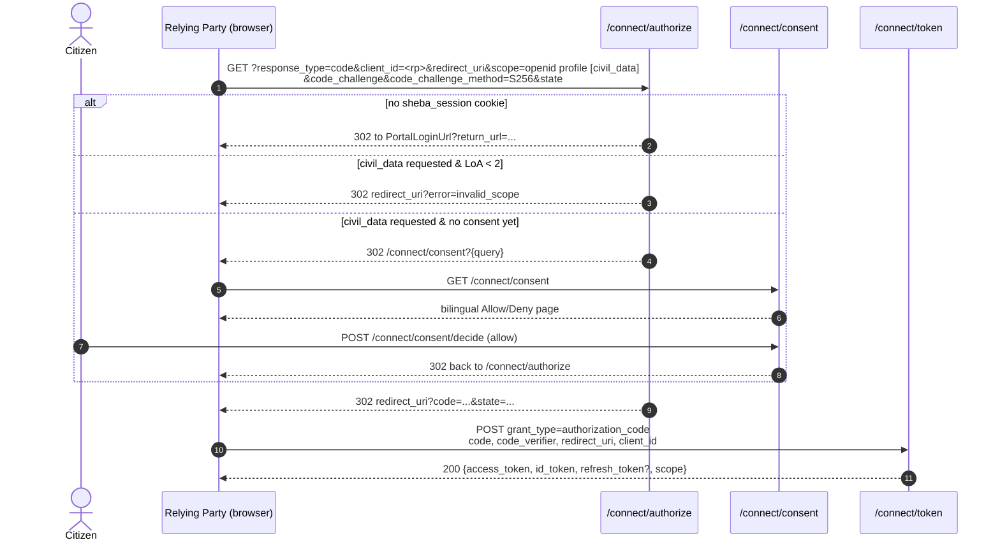

# Sheba — Frontend Authentication Flows

> Step-by-step authentication & authorization flows with sequence diagrams and **exactly what the
> frontend does after each response**. Grounded in the current implementation. Endpoint field
> details live in [frontend-api.md](frontend-api.md); code recipes in
> [frontend-examples.md](frontend-examples.md).

Mermaid diagrams render on GitHub and in most IDEs. ASCII flow ladders are included for quick reading.

---

## Contents

1. [Actors, clients & tokens](#1-actors-clients--tokens)
2. [Citizen Registration (onboarding)](#2-citizen-registration-onboarding)
3. [Identity Verification (OTP + email)](#3-identity-verification)
4. [Admin Approval](#4-admin-approval)
5. [Citizen Login + OTP → tokens](#5-citizen-login--otp--tokens)
6. [Refresh Token](#6-refresh-token)
7. [Logout](#7-logout)
8. [Password Reset](#8-password-reset-partially-implemented)
9. [Admin Login](#9-admin-login)
10. [MFA Enrollment / Verification / Recovery Codes](#10-admin-mfa)
11. [OIDC Authorization Code + PKCE ("Sign in with Sheba")](#11-oidc-authorization-code--pkce)
12. [Token Refresh & Revocation in OIDC](#12-token-refresh--revocation)
13. [LoA upgrade](#13-loa-upgrade)
14. [State → screen map](#14-state--screen-map)

---

## 1. Actors, clients & tokens

| Concept | Value |
|---------|-------|
| Citizen client | `sheba-portal` — **public**, PKCE, may use `urn:sheba:grant:national_id_otp` |
| Admin client | `sheba-admin` — **confidential** (`sheba-admin-dev-secret`), may use `urn:sheba:grant:admin_password` |
| Machine client | `sheba-api-internal` — client_credentials |
| Access token | JWT RS256, **15 min**, `Authorization: Bearer` |
| Refresh token | 30 days, **rotating**, family reuse-detection (replay revokes the family) |
| ID token | `sub`, `name`, `preferred_username`, `email`, `national_id_hash`, `loa` |

Two hard rules the flows below depend on:

1. **The subject id (`sub`) is never sent by the client** — the server reads it from the token. You
   never put `accountId`/`adminId` in a body for an authenticated action.
2. **Login requires an `Approved` account**; every citizen login also requires an SMS OTP (second
   factor), and every enrolled-admin login also requires a TOTP/recovery code.

---

## 2. Citizen Registration (onboarding)

Four API steps, then a wait for a human admin. No token exists yet — all steps are anonymous.

```
Enter National ID + registered phone
        ↓  POST /api/identity/register        → { accountId, maskedPhone }
Show "enter the code we texted you"
        ↓  (SMS OTP arrives; dev: console log)
Enter 6-digit OTP
        ↓  POST /api/identity/verify-otp       → { message }
Set username / email / password
        ↓  POST /api/identity/complete-registration → { accountId, identityRequestId }
Show "check your email"
        ↓  (email link → your frontend route with token)
Confirm email
        ↓  POST /api/identity/verify-email      → { message }
Show "Pending approval" WAITING SCREEN
        ↓  (admin approves out-of-band; citizen emailed)
Login enabled
```

### Sequence

```mermaid
sequenceDiagram
    autonumber
    actor C as Citizen
    participant FE as Frontend
    participant API as /api/identity
    C->>FE: national ID + phone
    FE->>API: POST /register {nationalId, phoneNumber}
    API-->>FE: 200 success {accountId, maskedPhone}
    Note over FE: store accountId; show OTP screen
    C->>FE: OTP from SMS
    FE->>API: POST /verify-otp {accountId, otp}
    API-->>FE: 200 success {message}
    C->>FE: username, email, password
    FE->>API: POST /complete-registration {...}
    API-->>FE: 200 success {accountId, identityRequestId}
    Note over FE: show "check your email"
    C->>FE: clicks email link (token)
    FE->>API: POST /verify-email {accountId, token}
    API-->>FE: 200 success {message}
    Note over FE: show WAITING-FOR-APPROVAL screen
```

**What the frontend does after each response**

| After | Do |
|-------|-----|
| `register` 200 | Persist `accountId` (session/local). Navigate to OTP entry. Show `maskedPhone`. |
| `register` 422 | Show the single generic `registration` message; let them re-check NID/phone. Do **not** reveal which field failed. |
| `verify-otp` 200 | Navigate to the account-details form. |
| `verify-otp` 400 | Show `data.otp`; allow retry (max 3 attempts, then they must restart register). |
| `complete-registration` 200 | Navigate to a "check your email" screen. |
| `complete-registration` 400 | Map `data` keys → form fields (`username`, `email`, `password`, `confirmPassword`). |
| `verify-email` 200 | Navigate to the **waiting-for-approval** screen. There is **no polling endpoint** for approval status a citizen can call; instruct them to watch their email. |
| `verify-email` 400 | "Link invalid/expired" — offer to restart. |

**Note:** the email link's landing page is **your** frontend route (e.g. `/verify-email?accountId=…&token=…`);
it should extract the params and POST them to `verify-email`.

---

## 3. Identity Verification

Two independent verifications happen during onboarding:

- **Phone (OTP):** 6 digits, CSPRNG, 5-min TTL, **max 3 attempts**, previous OTPs invalidated on
  re-issue, throttled per-IP (`identity_otp`: 10/5 min). Delivered by SMS (dev: console).
- **Email:** single-use link, 15-min TTL. Confirming it moves the request to `PendingAdminApproval`.

There is **no standalone "resend OTP" endpoint**. A fresh OTP is issued implicitly when a citizen
re-submits `register` (onboarding) or `login` (login). Design your UI so "resend" re-invokes the
appropriate step.

---

## 4. Admin Approval

Performed by an `IdentityReviewer`/`SuperAdmin` in the admin app — a **separate** surface from the
citizen flow.

```mermaid
sequenceDiagram
    autonumber
    actor A as Reviewer (admin)
    participant FE as Admin app
    participant API as /api/admin/identity-requests
    A->>FE: open review queue
    FE->>API: GET /?status=Pending&page=1&pageSize=20
    API-->>FE: 200 success {items[], totalCount, ...}
    A->>FE: open a request, inspect snapshot + docs
    alt Approve
        FE->>API: POST /{requestId}/approve {notes?}
        API-->>FE: 200 success {requestId, accountId, message}
    else Reject
        FE->>API: POST /{requestId}/reject {rejectionReason, notes?}
        API-->>FE: 200 success {requestId, accountId, message}
    end
    Note over API: emits IdentityRequestDecidedEvent → citizen emailed;<br/>on approval a Wallet VC is auto-issued
```

**After approve/reject:** refetch the queue (the acted-on request drops out of `Pending`). Show a
toast with `data.message`. The citizen learns the outcome **by email**, not in-app.

**Reviewer identity** is always the admin's own token `sub` — never a body field.

---

## 5. Citizen Login + OTP → tokens

Two logical steps, but the second is best done as a **single** `/connect/token` call.

```
Username or National ID + password
        ↓  POST /api/identity/login          → { accountId, maskedPhone }   (dispatches SMS OTP)
Show OTP screen
        ↓  (SMS OTP)
Enter OTP  →  POST /connect/token  grant=urn:sheba:grant:national_id_otp
                                     account_id + otp + client_id + scope
        ↓  200 { access_token, id_token, refresh_token, expires_in }
Store tokens → navigate to dashboard
```

### Sequence

```mermaid
sequenceDiagram
    autonumber
    actor C as Citizen
    participant FE as Frontend (sheba-portal)
    participant API as /api/identity
    participant T as /connect/token
    C->>FE: usernameOrNid + password
    FE->>API: POST /login {usernameOrNid, password}
    API-->>FE: 200 success {accountId, maskedPhone}
    Note over FE: store accountId; show OTP screen
    C->>FE: OTP
    FE->>T: POST grant_type=urn:sheba:grant:national_id_otp<br/>account_id, otp, client_id=sheba-portal, scope
    T-->>FE: 200 {access_token, id_token, refresh_token, expires_in=900, scope}
    Note over FE: store tokens securely; schedule refresh; go to dashboard
```

**Why go straight to `/connect/token` (not `/login/verify-otp`)?** The custom grant internally runs
`VerifyLoginOtpCommand` (the same logic as `/login/verify-otp`) and, on success, mints tokens in one
round-trip. Calling `/login/verify-otp` separately would consume the OTP before the grant re-checks
it. **Recommended:** `login` → then `connect/token` with the OTP.

**After each response**

| After | Do |
|-------|-----|
| `login` 200 | Store `accountId`; show OTP screen; display `maskedPhone`. |
| `login` 400 | Generic `credentials` error — do not distinguish "no user" vs "wrong password". |
| `login` 422 | Account not `Approved` or locked — show a helpful message ("your account is pending approval" / "temporarily locked, try again later"). |
| `connect/token` 200 | Store `access_token` (memory) + `refresh_token` (secure). Decode `id_token` for display name/loa. Schedule refresh ~1 min before `expires_in`. Navigate in. |
| `connect/token` 400 `invalid_grant` | Wrong/expired OTP — let them retry (re-`login` re-sends a code). |

**Lockout:** 5 failed passwords → exponential lock `2^(n-4)` minutes. Surface a "too many attempts"
message on repeated 422s.

---

## 6. Refresh Token

Rotating refresh tokens with **family reuse-detection**. Every successful refresh returns a **new**
refresh token; the old one is now invalid. Replaying a superseded token revokes the whole family
(forces a fresh login).



**Rules for the frontend:**
- Always **overwrite** the stored refresh token with the one just returned. Never keep the old one.
- Refresh **proactively** ~60 s before expiry, and **reactively** on a `401` (see
  [frontend-integration.md](frontend-integration.md) for the single-flight interceptor).
- On `invalid_grant` during refresh → wipe tokens and route to login.
- Confidential clients (admin) must include `client_secret` on refresh; public (`sheba-portal`) does not.

---

## 7. Logout

```
Local: discard access + refresh tokens from storage → route to /login
Optional server: POST /connect/revoke  (revoke the refresh token)
Optional OIDC:  GET  /connect/logout   (end the OpenIddict session; browser flows)
```

- For a first-party SPA/mobile app, **clearing local tokens is the primary logout**. Also call
  `/connect/revoke` with the refresh token so it can't be reused.
- For browser SSO sessions (the `sheba_session` cookie / third-party RP sessions), redirect to
  `/connect/logout` to clear the server session and (optionally) `post_logout_redirect_uri` back.
- There is no "logout everywhere" citizen endpoint; admin-driven force-revocation exists on the
  account-suspension path (not a self-service API).

---

## 8. Password Reset (🟡 PARTIALLY IMPLEMENTED)

**Status:** the application commands (`RequestPasswordResetCommand`, `ConfirmPasswordResetCommand`)
and the request-side validator exist, but **no HTTP route is wired** — the paths below return **404**
today. Build the screens; gate the network calls behind a feature flag.

**Planned flow:**

```
Enter username or National ID
   ↓  POST /api/identity/password-reset/request {usernameOrNid}
   → always 200 generic "if the account exists, a code was sent" (anti-enumeration)
Enter OTP + new password
   ↓  POST /api/identity/password-reset/confirm {usernameOrNid, otp, newPassword, confirmNewPassword}
   → 200 generic success  (every failure path returns the SAME generic error)
Navigate to login
```

Design implications: **never** tell the user whether the identifier existed; show the same "if your
account exists, we sent a code" message either way. The OTP is delivered only to the registry phone.

---

## 9. Admin Login

Admins authenticate with a **different principal** and grant than citizens. One human who is both a
citizen and an admin still has two separate identities/tokens.

```
employee_id_or_email + password  (+ mfa_code once enrolled)
   ↓  POST /connect/token  grant=urn:sheba:grant:admin_password
        client_id=sheba-admin, client_secret=sheba-admin-dev-secret, scope=openid profile admin_api
   → 200 {access_token(role=SuperAdmin|...), id_token, refresh_token}
Store tokens → admin dashboard
```



**After 200:** decode the token's `role` claim to drive the admin UI (which menus/policies are
available — see [frontend-api.md §3.2](frontend-api.md#32-roles-the-role-claim)). A
`MinistryManager` also carries `ministry_id`; scope all ministry/service/report views to it.

**MFA lockout:** 5 invalid MFA attempts lock the second factor for `2^(n-4)` minutes.

---

## 10. Admin MFA

TOTP (RFC 6238: SHA1, 6 digits, 30-s step). Opt-in until enrolled, mandatory once enrolled.

### 10.1 Enrollment (two steps, requires an existing admin token)

```mermaid
sequenceDiagram
    autonumber
    actor A as Admin
    participant FE as Admin app
    participant API as /api/admin/mfa
    Note over A,FE: admin already logged in (password-only, pre-enrollment)
    FE->>API: POST /enroll   (Bearer token, no body)
    API-->>FE: 200 success {secret, provisioningUri}
    Note over FE: render provisioningUri as QR (or show secret)
    A->>A: scan with authenticator app
    A->>FE: enters live 6-digit code
    FE->>API: POST /verify {totpCode}
    alt valid
        API-->>FE: 200 success {recoveryCodes: [10 codes]}
        Note over FE: show recovery codes ONCE; force "I saved these"
    else invalid
        API-->>FE: 400/422 fail {mfa}
    end
```

**After `/enroll` 200:** show the QR + a manual-entry fallback (`secret`). Prompt for a code.
**After `/verify` 200:** display the 10 `recoveryCodes` exactly once, require an acknowledgement,
then never show them again. MFA is now enforced on subsequent logins.

### 10.2 Verification at login

Once enrolled, include `mfa_code` in the `admin_password` grant (a live TOTP **or** an unused
recovery code). Missing → `invalid_grant` / `mfa_required`; wrong → `invalid_grant` / `mfa`.

### 10.3 Recovery Codes

10 single-use codes, Argon2id-hashed server-side, issued once at `/verify`. Each can substitute for a
TOTP code in the `mfa_code` field exactly once. There is **no** endpoint to regenerate them in the
current implementation — treat them as a finite fallback.

---

## 11. OIDC Authorization Code + PKCE

This is **"Sign in with Sheba"** — the flow a **third-party relying party** (another ministry portal)
uses to authenticate a citizen via Sheba, and the flow the web portal uses for browser SSO.

> **Use a standard OIDC/PKCE client library** (`oidc-client-ts`, AppAuth, `flutter_appauth`). Do not
> hand-roll `code_verifier`/`code_challenge`. The steps below explain what the library does so you
> can configure it and debug redirects.

### Prerequisite (first-party portal only)

The citizen must already have a browser **session cookie**. The portal establishes it once after a
normal password+OTP login:

```
POST /api/identity/session/establish  (Bearer <access_token>)  → Set-Cookie: sheba_session
```

A pure third-party RP doesn't do this — if the citizen has no `sheba_session`, `/connect/authorize`
redirects them to `Identity:PortalLoginUrl` to log in first.

### Flow



**After each hop (what your library/handler does):**

| Event | Do |
|-------|-----|
| Build authorize URL | Generate `code_verifier` (store it), derive `code_challenge` (S256), include `state` + `nonce`. |
| Redirect to `PortalLoginUrl` | The citizen isn't signed in — send them through portal login, then retry authorize. |
| `error=invalid_scope` | LoA too low for `civil_data`; either drop the scope or send the citizen to upgrade LoA (§13). |
| Consent page | For third-party RPs the citizen sees a bilingual Allow/Deny prompt; nothing for you to render. |
| `error=access_denied` | Citizen declined consent — handle gracefully (don't auto-retry). |
| Receive `code` + `state` | **Verify `state` matches** what you sent. Exchange `code` + `code_verifier` at `/connect/token`. |
| Token 200 | Validate `id_token` (`iss`, `aud`, `nonce`, signature via JWKS). Store tokens. |

`civil_data` is only granted at **LoA ≥ 2** and (in this browser flow) only after a **one-time**
consent (2-min Redis marker, not remembered across sessions — the citizen re-consents each time).

---

## 12. Token Refresh & Revocation (OIDC)

- **Refresh** in the browser flow is identical to §6 — `grant_type=refresh_token`, rotation,
  family reuse-detection. A refresh token minted through the PKCE flow also participates in family
  cascade-revocation.
- **Revocation:** `POST /connect/revoke` (RFC 7009) with `token` + client auth revokes a refresh (or
  access) token. **Introspection** (`/connect/introspect`, RFC 7662) is for resource servers, not
  SPAs.
- **Logout:** `GET/POST /connect/logout` ends the OpenIddict session.

---

## 13. LoA upgrade

To raise a citizen's Level of Assurance (needed for `civil_data`-class services/scopes):

```
Authenticated citizen → POST /api/identity/loa/upgrade { targetLevel: 2 }   (Bearer)
   → 200 { identityRequestId, targetLevel, message }
Show "upgrade request submitted"; it enters the SAME admin review queue as onboarding.
```

`AccountId` comes from the token — the body carries only `targetLevel`. After admin approval, the
citizen's next token will carry the higher `loa`, unlocking `civil_data`.

---

## 14. State → screen map

Drive citizen UI off `AccountStatus` (visible to admins via `GET /api/admin/accounts/{id}`; citizens
infer it from which calls succeed):

| `AccountStatus` | Meaning | Citizen screen |
|-----------------|---------|----------------|
| `PendingVerification` | OTP not yet verified | OTP entry |
| `PendingEmailVerification` | phone done, email not | "check your email" |
| `PendingAdminApproval` | email done, awaiting review | **waiting for approval** |
| `Approved` | active | login enabled → dashboard |
| `Rejected` | reviewer rejected | show reason (from email); allow re-application |
| `Suspended` | security hold | "account suspended, contact support" |
| `Deactivated` | closed | terminal |

Login (`/api/identity/login`) only succeeds in `Approved`; every other status yields a 422 you should
translate into the matching message above.

---

*Generated from source on 2026-07-18. Flows verified against `IdentityModule.cs`,
`Oidc/OidcEndpoints.cs`, `Oidc/AuthorizeEndpoints.cs`, and the Application command handlers.*
