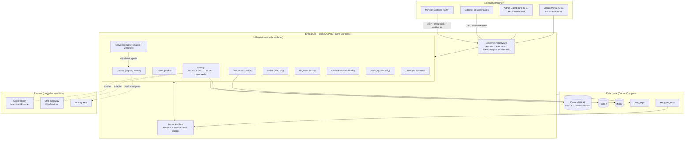
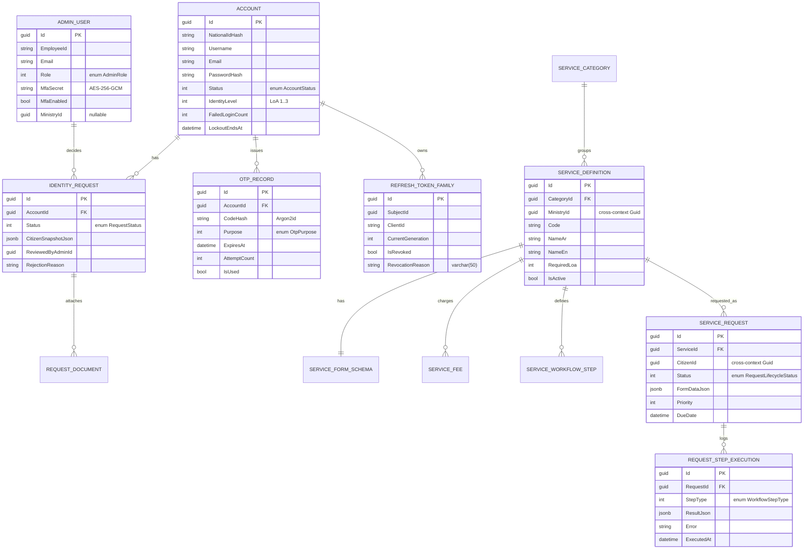
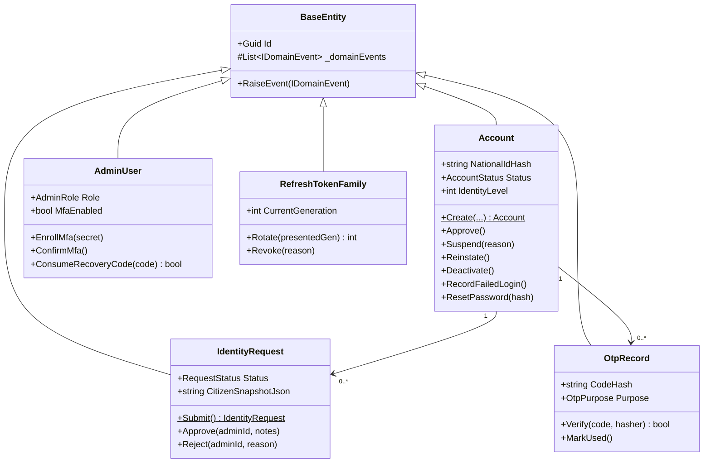
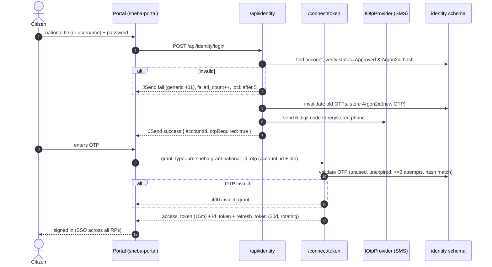
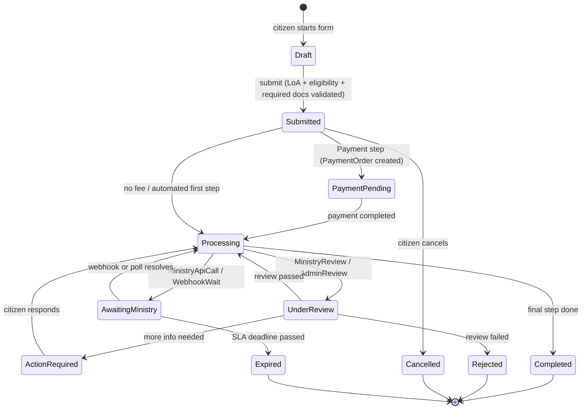

# الفصل الثالث: تحليل وتصميم النظام (Analysis & Design)

> هذا الفصل مُستخرَج من التنفيذ الفعلي لمنصة **شبَـأ (Sheba)** كما هي في مستودع الشيفرة، وليس تصميماً
> نظرياً. كل مخطط وجدول هنا يقابله كود قائم تحت `src/`. المرجع المعماري الأساسي هو
> [docs/sheba.md](../sheba.md).

---

## 3.1 منهجية التطوير (Development Methodology)

### المنهجية المختارة: **Agile التكرارية (Iterative / Scrum-lite)**

اعتمد المشروع منهجية رشيقة تكرارية قائمة على **قائمة مهام محكومة بمعرّفات** (Task IDs بصيغة `T-XXX-n`
في ملف [TASKS.md](../../TASKS.md))، حيث تُسلَّم كل ميزة أو تحسين أمني في دفعة صغيرة قابلة للمراجعة
والاختبار والدمج بشكل مستقل.

#### تبرير الاختيار

| المعيار | لماذا Agile وليس Waterfall |
|---------|----------------------------|
| **عدم اكتمال المتطلبات مسبقاً** | شكل واجهة السجل المدني الحكومي الحقيقي (Civil Registry API) غير معروف، فتم عزله خلف منفذ `INationalIdProvider` وتطويره تدريجياً بمزوّد وهمي (Mock) أولاً. |
| **الطبيعة الأمنية الحرجة** | متطلبات الأمن (منع التعداد، تدوير الرموز، MFA) اكتُشفت وصُلّبت عبر تكرارات (T-SEC-1 … T-SEC-9)، وهو ما تعجز نماذج الشلال المتسلسلة عن استيعابه. |
| **التوثيق كشيفرة (Docs-as-Code)** | كل تغيير سلوكي يُحدِّث الوثيقة في نفس التغيير (قاعدة في `CLAUDE.md`)، وهو انضباط تكراري لا لحظي. |
| **قابلية العرض المستمر** | كل وحدة (Module) تُبنى وتُختبر مستقلة، فيمكن عرض تقدّم ملموس في نهاية كل تكرار. |

> **لماذا لا Waterfall؟** لأن المشروع بحاجة لدورات «صمّم – نفّذ – اختبر أمنياً – صلّب» متكررة على
> نفس المكوّن (مثال: تدفّق تسجيل الدخول مرّ بثلاث تكرارات حتى وصل إلى نمط «الهوية من الرمز لا من الجسم»).

### أدوات إدارة العملية
- **مصدر المهام:** `TASKS.md` + `docs/known-issues.md` (سجل الثغرات المعروفة).
- **التحكم بالإصدارات:** Git، مع ربط كل Commit/PR بمعرّف مهمة.
- **تعريف الإنجاز (Definition of Done):** بناء ناجح `dotnet build` + اختبارات خضراء `dotnet test` +
  تحديث الوثيقة ذات الصلة.

---

## 3.2 جمع المتطلبات (Requirements Gathering)

### 3.2.1 المتطلبات الوظيفية (Functional Requirements)

| # | المتطلب | الوصف | الوحدة المسؤولة |
|---|---------|-------|-----------------|
| FR-1 | تسجيل مواطن (eKYC) | التحقق من الرقم الوطني + الهاتف مقابل السجل المدني، ثم OTP، ثم إنشاء بيانات الدخول | Identity |
| FR-2 | التحقق بالبريد | رابط تفعيل بريدي أحادي الاستخدام صالح 15 دقيقة | Identity |
| FR-3 | موافقة إدارية بشرية | مراجع الهوية يوافق/يرفض الطلب مع سبب | Identity |
| FR-4 | تسجيل الدخول برمز OTP | كلمة مرور + OTP عبر SMS في كل دخول (نمط Absher) | Identity |
| FR-5 | مزوّد هوية OIDC/OAuth 2.1 | «سجّل الدخول عبر شبأ» للأطراف المعتمدة (Relying Parties) | Identity/OpenIddict |
| FR-6 | إدارة الأطراف المعتمدة | تسجيل/تدوير سر/حذف عملاء OIDC | Identity |
| FR-7 | مصادقة إدارية بعامل ثانٍ (MFA/TOTP) | تسجيل TOTP + رموز استرداد | Identity |
| FR-8 | كتالوج خدمات حكومية | فئات → خدمات → مخطط نموذج (JSON Schema) + رسوم + مستندات | ServiceRequest |
| FR-9 | دورة حياة طلب خدمة | تقديم → دفع → معالجة → مراجعة → إكمال عبر محرك خطوات (Workflow Engine) | ServiceRequest |
| FR-10 | تكامل الوزارات | سجلّ وزارات + خزنة اعتماد مشفّرة + مُحوّلات مصادقة (Auth Adapters) | Ministry |
| FR-11 | استقبال Webhooks موقّعة | استقبال ردود الوزارات موقّعة بـ HMAC | ServiceRequest |
| FR-12 | إدارة المستندات | رفع/تنزيل عبر روابط مُوقّتة (MinIO) وملكية صارمة | Document |
| FR-13 | المحفظة الرقمية (VC) | إصدار شهادات موثّقة W3C كـ JWT-VC عند الموافقة | Wallet |
| FR-14 | المدفوعات (وهمية) | أوامر دفع للرسوم مع مقبس بوابة قابل للاستبدال | Payment |
| FR-15 | الإشعارات | بريد/SMS مدفوع بالأحداث + سجل تسليم | Notification |
| FR-16 | سجل تدقيق غير قابل للتعديل | تسجيل من/ماذا/متى لكل أمر مُغيِّر للحالة | Audit |
| FR-17 | لوحة مؤشرات وتقارير | KPIs + اتجاهات + تقارير PDF/Excel/CSV | Admin |

### 3.2.2 المتطلبات غير الوظيفية (Non-Functional Requirements)

| البُعد | المتطلب | كيف تحقّق في التنفيذ |
|--------|---------|----------------------|
| **الأمن** | ممارسات OWASP ASVS L2 + تقليل بيانات PII | Argon2id لكلمات المرور وOTP؛ AES-256-GCM لاعتمادات الوزارات؛ PKCE إلزامي؛ منع تعداد الحسابات (رسالة خطأ عامة موحّدة)؛ منع تسجيل PII في السجلّات |
| **الأداء** | زمن استجابة منخفض على شبكات ضعيفة (2G) | حمولات JSON صغيرة؛ رمز وصول قصير (15 دقيقة)؛ ذاكرة Redis للتخزين المؤقت وعدّادات التحكم |
| **الموثوقية** | صمود أمام أعطال الوزارات الخارجية | خط مرونة (Retry/Circuit-Breaker/Timeout) عبر `Microsoft.Extensions.Http.Resilience` (Polly v8) |
| **الاتساق** | تسليم أحداث موثوق بين الوحدات | نمط **Transactional Outbox** + Hangfire dispatcher |
| **قابلية التوسع** | مسار نمو نحو الخدمات المصغّرة | Modular Monolith بحدود صارمة؛ كل وحدة بذرة استخراج (Extraction Seam) |
| **قابلية الصيانة** | حدود معمارية مفروضة بالمترجم | مشروع كل وحدة يعتمد فقط على `Sheba.Shared.Kernel` |
| **التوطين** | ثنائية اللغة (عربي/إنجليزي) | كل حقل موجّه للمواطن يحمل زوج `NameAr`/`NameEn` |
| **التتبّعية** | ربط كل سجل بطلب واحد | ترويسة `X-Correlation-Id` تُولّد/تُعاد في كل استجابة |
| **معدّل الطلبات** | حماية نقاط المصادقة من الإغراق | Rate limiting بنوافذ منزلقة (Redis) على التسجيل/الدخول/OTP/الرمز |

---

## 3.3 تحليل النظام: مخطط حالات الاستخدام (Use Case Diagram)

الفاعلون: **المواطن**، و**المشرف** بأدواره الخمسة (SuperAdmin، IdentityReviewer، MinistryManager،
Auditor، Support)، و**نظام الوزارة** (عميل آلي)، و**الطرف المعتمد الخارجي** (RP).

```mermaid
graph TB
    Citizen(("👤 Citizen"))
    Admin(("🛡️ Admin<br/>(5 roles)"))
    Ministry(("🏛️ Ministry System"))
    RP(("🔗 External RP"))

    subgraph Sheba["Sheba e-Government Platform"]
        UC1["Register & Verify Identity (eKYC)"]
        UC2["Login with Password + SMS OTP"]
        UC3["Browse Service Catalog"]
        UC4["Submit & Track Service Request"]
        UC5["Upload / Download Documents"]
        UC6["View Digital Credentials (Wallet)"]
        UC7["Pay Service Fees"]
        UC8["Review & Approve/Reject Identity Requests"]
        UC9["Manage Ministries & Credentials"]
        UC10["Manage Service Catalog"]
        UC11["Register Relying Parties (SSO clients)"]
        UC12["Enroll & Verify MFA (TOTP)"]
        UC13["View KPIs, Trends & Export Reports"]
        UC14["Read Append-only Audit Log"]
        UC15["Sign in with Sheba (OIDC + PKCE)"]
        UC16["Send Signed Webhook Callbacks"]
    end

    Citizen --> UC1 & UC2 & UC3 & UC4 & UC5 & UC6 & UC7
    Admin --> UC8 & UC9 & UC10 & UC11 & UC12 & UC13 & UC14
    RP --> UC15
    Ministry --> UC16
    UC4 -. include .-> UC7
    UC1 -. include .-> UC2
```



**ملاحظة على الأدوار:** لا يمكن تسجيل الدخول في أي حالة عدا `Approved`. صلاحيات المشرفين محكومة
بسياسات مبنية على مطالبة `role` (انظر §3.7).

---

## 3.4 البنية المعمارية (Architecture)

النظام **Modular Monolith**: عملية ASP.NET Core 9 واحدة (`Sheba.Api`)، قاعدة بيانات PostgreSQL
واحدة بـ **مخطط لكل وحدة (Schema-per-Module)**، عشر وحدات معزولة تتصرّف كخدمات مصغّرة عدا حدود العملية.



### قواعد الحدود غير القابلة للتفاوض
1. مشروع الوحدة يشير **فقط** إلى `Sheba.Shared.Kernel` (استثناء موثّق واحد: ServiceRequest → منافذ Ministry).
2. **لا وصول عبر المخططات (No cross-schema DB access).** المراجع بين السياقات مجرّد `Guid`.
3. التواصل بين الوحدات حصراً عبر: (أ) أحداث تكامل MediatR، أو (ب) منافذ استعلام في `Shared.Kernel.Interfaces`.
4. قواعد العمل تعيش على **الكيانات الجذرية (Aggregates)** لا في المعالجات (Handlers).

### خط أنابيب الطلب (Request Pipeline)
```
HTTPS → ExceptionHandler (JSend) → Correlation-Id → Serilog logging → Rate limiter
     → CORS → AuthN (OpenIddict) → AuthZ (policies) → JSend wrapping
     → Module minimal-API endpoints → MediatR pipeline:
        Logging → Validation (FluentValidation) → Transaction+Outbox → Audit → Handler
```

---

## 3.5 تصميم قاعدة البيانات (ERD)

كل وحدة تملك مخططها الخاص دون مفاتيح أجنبية عابرة للمخططات. يوضّح المخطط التالي نواة وحدتَي
**Identity** و**ServiceRequest** والعلاقة المنطقية بينهما (مرجع `Guid` فقط).



**شرح مختصر للجداول المحورية:**
- **`accounts`**: آلة حالة الحساب (LoA، القفل، عدّاد المحاولات). الرقم الوطني يُخزَّن كتجزئة (Hash) فقط.
- **`identity_requests`**: طلب الهوية مع لقطة السجل المدني المجمّدة (`CitizenSnapshotJson`) للمراجع البشري.
- **`otp_records`**: رمز OTP مُجزّأ بـ Argon2id، صلاحية 5 دقائق، 3 محاولات، أحادي الاستخدام.
- **`refresh_token_families`**: تتبّع عائلات رموز التحديث لكشف إعادة الاستخدام (سرقة الرمز).
- **`service_definitions` / `service_requests`**: الكتالوج والطلبات؛ يرتبطان بالمواطن والوزارة عبر `Guid` منطقي فقط.

> مخططات ERD الكاملة لكل وحدة موجودة في [docs/database-design.md](../database-design.md) وملفات `docs/diagrams/erd-*.mmd`.

---

## 3.6 مخططات UML الإضافية

### 3.6.1 مخطط الأصناف (Class Diagram) — نمط DDD Aggregates

قواعد العمل تعيش على الكيانات عبر مصانع ساكنة (Static Factories) وطرائق كاشفة للنيّة ترمي `DomainException`.



### 3.6.2 مخطط التتابع (Sequence Diagram) — تسجيل الدخول (كلمة مرور + OTP)



### 3.6.3 مخطط النشاط (Activity Diagram) — دورة حياة طلب الخدمة



كل انتقال يكتب صفّاً في `request_step_executions` (من، متى، النتيجة، الخطأ) ويرفع أحداثاً تستهلكها
وحدتا Notification وAdmin.

---

## 3.7 الأدوار والصلاحيات والسياسات (Roles, Claims & Policies)

تُطابَق أسماء السياسات مقابل مطالبة `role` في الرمز (JWT). المواطن يحمل `role=Citizen` والمشرف يحمل
اسم الدور من `AdminRole`.

| السياسة (Policy) | الأدوار المسموحة |
|------------------|-------------------|
| `CitizenOnly` | Citizen |
| `SuperAdminOnly` | SuperAdmin |
| `IdentityReviewer` | SuperAdmin, IdentityReviewer |
| `MinistryManager` | SuperAdmin, MinistryManager |
| `Auditor` | SuperAdmin, Auditor |
| `AnyAdmin` | SuperAdmin, IdentityReviewer, MinistryManager, Auditor, Support |

**المطالبات (Claims) في الرمز:** `sub`, `name`, `preferred_username`, `email`, `national_id_hash`
(تجزئة SHA-256)، `loa`، `role`، و`ministry_id` (لمدير الوزارة فقط). ملكية الموارد (مواطن يلمس بياناته
فقط، مدير وزارة يلمس وزارته فقط) تُفرَض في المعالجات لا في السياسات.

---

## 3.8 الأدوات والتقنيات (Tools & Technologies)

| الفئة | التقنية | الإصدار | التبرير |
|-------|---------|---------|---------|
| المنصة | .NET / ASP.NET Core | 9 / C# 13 | أداء عالٍ، Minimal APIs، دعم طويل الأمد |
| مزوّد الهوية | OpenIddict | 5.x | خادم OAuth 2.1/OIDC كامل المعايير دون ترخيص تجاري، يدعم المنح المخصّصة |
| ORM | EF Core + Npgsql | 9 | مخطط لكل وحدة، الهجرات كأدوات نشر |
| قاعدة البيانات | PostgreSQL | 16 | عشرة مخططات، JSONB للّقطات، موثوقية عالية |
| الذاكرة المؤقتة | Redis | 7 | عدّادات معدّل OTP، كاش، علامات الموافقة |
| تخزين الكائنات | MinIO | latest | متوافق S3، قابل للاستضافة محلياً (سيادة البيانات) |
| الوسيط الداخلي | MediatR | 12 | أوامر/استعلامات/أحداث + سلوكيات خط الأنابيب |
| المهام المجدولة | Hangfire (+PostgreSql) | 1.8 | موزّع الـ Outbox، التقارير، تنظيف OTP |
| التحقق من المدخلات | FluentValidation | 11 | يغذّي مظاريف JSend `fail` |
| التسجيل | Serilog → Seq | — | سجلّات مهيكلة بمعرّف ارتباط |
| التشفير | Isopoh Argon2id | — | تجزئة كلمات المرور وOTP (مقاوم للذاكرة) |
| المرونة | Microsoft.Extensions.Http.Resilience | 9 | Retry/Circuit-Breaker/Timeout (Polly v8) |
| التقارير | QuestPDF / ClosedXML / CsvHelper | — | توليد PDF/Excel/CSV |
| توثيق API | Swashbuckle (Swagger) | — | استكشاف واجهة API |
| الاختبار | xUnit + FluentAssertions + NSubstitute + Testcontainers | — | وحدة + تكامل بحاويات حقيقية |
| التشغيل | Docker Compose | — | Postgres + Redis + MinIO + Seq + MailHog بأمر واحد |

---

**الخلاصة:** يقدّم هذا الفصل تصميماً محكوماً بالحدود، أمنياً بالتصميم (Security by Design)، وقابلاً
للتوسّع نحو الخدمات المصغّرة، مع تتبّعية كاملة بين المتطلبات والمكوّنات والكيانات — وكلّها مُنفّذة فعلياً
لا مقترَحة.
