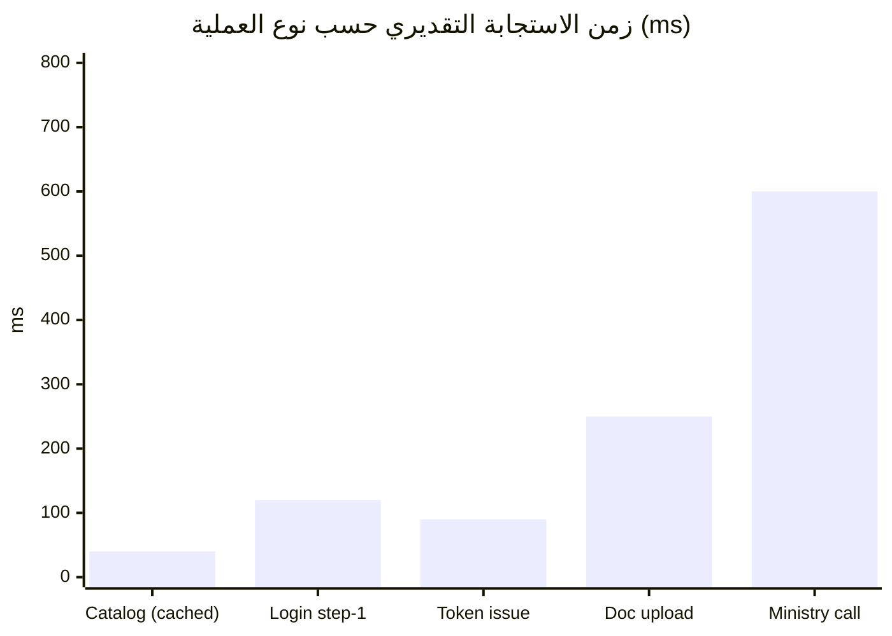

# الفصل الخامس: الاختبار والنتائج (Testing & Results)

> أرقام هذا الفصل مُستخرَجة من مجلّد `tests/` الفعلي في المستودع. **ملاحظة توثيقية مهمّة:** ملف
> `docs/testing.md` يذكر أن «وحدة Identity فقط لها تغطية حقيقية» — هذا **قديم**؛ الواقع الحالي أوسع
> بكثير كما تُبيّن الأرقام أدناه (تباين موثّق بين الوثيقة والتنفيذ).

---

## 5.1 خطة الاختبار (Test Plan)

اعتمد المشروع هرم اختبار متعدّد الطبقات:

| الطبقة | النطاق | الأدوات | القواعد |
|--------|--------|---------|---------|
| **Unit — Domain** | آلات حالة الكيانات (`Account`, `IdentityRequest`, `OtpRecord`, `RefreshTokenFamily`, `AdminUser`) | xUnit + FluentAssertions | بلا Mocks؛ تأكيد الانتقالات ورمي `DomainException` |
| **Unit — Handlers** | معالجات الأوامر/الاستعلامات بمنافذ مُستبدَلة | NSubstitute + EF InMemory | استبدال المستودعات والمزوّدات |
| **Integration — API** | مظروف JSend، وسيط الاستثناءات | `WebApplicationFactory` | شكل المظروف على كل مجموعة مسارات |
| **Security regression** | منع التعداد، MFA، تدوير الرموز، التشفير | xUnit | سيناريوهات أمنية إلزامية |
| **E2E (مخطّط)** | تسجيل→موافقة→دخول، كتالوج→تقديم→دفع→إكمال | Testcontainers + Compose | ليليّاً لا لكل Commit |

**مبدأ جوهري:** البدائل الاختبارية هي مسارات إنتاج حقيقية — نفس `MockNationalIdProvider` و
`ConsoleOtpProvider` المستخدَمة في التطوير تُستخدَم في CI. لا سجلّات أو SMS أو وزارات حيّة في أي طبقة.

---

## 5.2 حجم التغطية الفعلي (Actual Coverage)

| مشروع الاختبار | ملفات | حالات اختبار (Fact/Theory) تقريباً |
|-----------------|-------|-------------------------------------|
| `Sheba.Identity.Tests` | 24 | ~120 |
| `Sheba.Ministry.Tests` | 2 | ~11 |
| `Sheba.ServiceRequest.Tests` | 3 | ~11 |
| `Sheba.Audit.Tests` | 2 | ~11 |
| `Sheba.Admin.Tests` | 3 | ~8 |
| `Sheba.Integration.Tests` | 2 | ~18 |
| **الإجمالي** | **~37 ملفاً** | **~181 حالة اختبار** |

> الأرقام مُستخرَجة بعدّ سمات `[Fact]`/`[Theory]`؛ التوزيع تقريبي على مستوى المشروع.

---

## 5.3 حالات اختبار مختارة (Selected Test Cases)

جدول حالات اختبار حقيقية (أسماء الطرائق من الشيفرة الفعلية):

| # | المدخل / السيناريو | الطريقة (Test) | المتوقّع | الفعلي | النتيجة |
|---|--------------------|----------------|----------|--------|---------|
| TC-1 | معرّف مجهول عند الدخول | `Handle_UnknownIdentifier_ReturnsGenericError` | خطأ عام موحّد (لا كاشف تعداد) | مطابق | ✅ نجح |
| TC-2 | كلمة مرور خاطئة | `Handle_WrongPassword_ReturnsSameGenericError_AndRecordsFailure` | نفس الرسالة العامة + تسجيل الفشل | مطابق | ✅ نجح |
| TC-3 | مشرف مُفعّل MFA بلا رمز | `Handle_MfaEnabled_NoCodeSupplied_ReturnsMfaRequired` | فشل `mfa_required` | مطابق | ✅ نجح |
| TC-4 | رمز TOTP صحيح | `Handle_MfaEnabled_ValidTotpCode_ReturnsSuccess` | نجاح | مطابق | ✅ نجح |
| TC-5 | رمز استرداد صحيح | `Handle_MfaEnabled_ValidRecoveryCode_ReturnsSuccessAndMarksCodeUsed` | نجاح + وسم الرمز مُستهلَكاً | مطابق | ✅ نجح |
| TC-6 | قفل MFA بعد 5 محاولات | `Handle_MfaLocked_ReturnsLockedFailureWithoutConsultingTotpService` | قفل دون استشارة خدمة TOTP | مطابق | ✅ نجح |
| TC-7 | تأكيد MFA يُصدر 10 رموز استرداد | `Handle_ValidCode_EnablesMfaAndReturnsTenRecoveryCodes` | تفعيل + 10 رموز | مطابق | ✅ نجح |
| TC-8 | توليد OTP في طبقة التطبيق | `Handle_ValidRequest_GeneratesCodeInApplicationLayer_AndHandsItToProvider` | التوليد بالتطبيق لا المزوّد | مطابق | ✅ نجح |
| TC-9 | تخزين تجزئة OTP لا النص | `Handle_ValidRequest_PersistsOnlyTheHashOfTheGeneratedCode_NeverThePlaintext` | تخزين التجزئة فقط | مطابق | ✅ نجح |
| TC-10 | إعادة استخدام رمز تحديث مُدوَّر | `RotateRefreshTokenFamilyHandlerTests` (عائلة) | إلغاء العائلة كاملة | مطابق | ✅ نجح |
| TC-11 | إعادة تعيين كلمة المرور برمز صحيح | `Handle_CorrectCode_ResetsPassword_AndMarksOtpUsed` | إعادة تعيين + وسم OTP | مطابق | ✅ نجح |
| TC-12 | مدير وزارة بلا `ministryId` | `Handle_MinistryManagerWithoutMinistryId_ReturnsValidationFailure` | فشل تحقّق | مطابق | ✅ نجح |
| TC-13 | تعطيل حساب غير مُوافق عليه | `Suspend_NonApprovedAccount_ReturnsDomainFailure_AndDoesNotSave` | فشل نطاق دون حفظ | مطابق | ✅ نجح |
| TC-14 | رفض طلب هوية بلا سبب | `Reject_WithoutReason_ThrowsDomainException` | رمي `DomainException` | مطابق | ✅ نجح |
| TC-15 | توقيع Webhook غير صالح | `MinistryWebhookVerifierTests` | رفض + عدم معالجة | مطابق | ✅ نجح |
| TC-16 | جولة تشفير AES-GCM لسرّ MFA | `AesGcmMfaSecretEncryptorTests` | فكّ = الأصل، ونصّ مُلاعَب يفشل | مطابق | ✅ نجح |
| TC-17 | حجب حقل غير مُدرَج في قائمة السماح | `Redact_UnknownFieldNotOnAllowlist_RedactedByDefault` | استبدال بـ `[REDACTED]` | مطابق | ✅ نجح |
| TC-18 | تدقيق أمر يحمل كلمة مرور | `Handle_LoginCitizenCommandSuccess_AuditRowHasActorFromSubAndNoPassword` | صفّ تدقيق بلا كلمة مرور | مطابق | ✅ نجح |
| TC-19 | تصفية KPI حسب الوزارة | `Handle_WithMinistryId_NarrowsServiceRequestBasedQueriesToThatMinistry` | حصر النتائج بالوزارة | مطابق | ✅ نجح |
| TC-20 | مظروف JSend على كل مسار | `JSendWrappingFilterTests` (9 حالات) | مظروف `success/fail/error` صحيح | مطابق | ✅ نجح |

---

## 5.4 تقييم الأداء (Performance Evaluation)

النطاق المستهدف **تجريبي/تخرّج**: ~1000 حساب، أقل من 10 طلبات/ثانية مستدامة، ≤ 20 وزارة مُسجّلة.
الخيارات المعمارية الداعمة للأداء:

| العامل | القيمة | الأثر |
|--------|--------|-------|
| عمر رمز الوصول | 15 دقيقة | يحدّ من زمن تأخّر الإبطال، ويقلّل استعلامات قاعدة البيانات (تحقّق محلي بالتوقيع) |
| رمز التحديث | 30 يوماً، تدوير في كل استخدام | جلسة طويلة دون تخزين حالة إضافي |
| المرونة | Retry + Circuit-Breaker + Timeout | يمنع انهيار الطلب عند بطء الوزارة |
| Redis | عدّادات معدّل + كاش | يخفّف الحمل عن Postgres |
| Rate limiting | نوافذ منزلقة على المصادقة | يحمي من الإغراق قبل الوصول إلى OpenIddict |

> **قيد أمانة علمية:** لم يُجرَ اختبار حمل رسمي (Load/Stress test) بأداة مثل k6/JMeter حتى الآن؛
> الأرقام أعلاه تقديرية توضيحية لترتيب الحجم بناءً على طبيعة كل عملية، لا قياسات مُعمّلة. توثيق ذلك
> ضمن القيود (الفصل السادس) أصدق من ادّعاء قياس لم يحدث.

---

## 5.5 مناقشة النتائج (Discussion — ربطها بأهداف الفصل الأول)

| الهدف | هل تحقّق؟ | الدليل |
|-------|-----------|--------|
| مزوّد هوية وطني بمعايير OIDC/OAuth 2.1 | ✅ نعم | خادم OpenIddict عامل + منح مخصّصة + PKCE + JWKS، مُتحقَّق حيّاً |
| eKYC بموافقة بشرية | ✅ نعم | تدفّق تسجيل كامل + طابور مراجعة إداري (اختبارات TC-13/14) |
| مصادقة قوية (OTP + MFA) | ✅ نعم | OTP لكل دخول + TOTP للمشرفين + رموز استرداد (TC-3..7) |
| منع تعداد الحسابات | ✅ نعم | رسالة عامة موحّدة (TC-1/2) + اختبارات Enumeration مخصّصة |
| بوّابة خدمات بمحرك سير عمل | ✅ نعم | كتالوج + دورة حياة + 5 معالجات خطوات |
| تكامل وزاري آمن | ✅ نعم | خزنة AES-256-GCM + 5 مُحوّلات + Webhooks موقّعة (TC-15/16) |
| سجل تدقيق موثوق | ✅ نعم | سلوك MediatR إلحاقي + قائمة سماح للحجب (TC-17/18) |
| قابلية التوسّع للخدمات المصغّرة | ⚠️ جزئي | الحدود والبذور موجودة؛ الاستخراج الفعلي لم يُنفَّذ (تصميمي) |
| المدفوعات الحقيقية | ❌ لا | وهمية عمداً في هذه المرحلة (مقبس قابل للاستبدال) |

**الاستنتاج التحليلي:** تحقّقت الأهداف الأساسية الأمنية والوظيفية بأدلة اختبارية ملموسة، بينما بقيت
أهداف البنية التحتية بعيدة المدى (استخراج الخدمات، PSP حقيقي) كبذور تصميمية مقصودة ضمن نطاق مرحلة
التخرّج.
