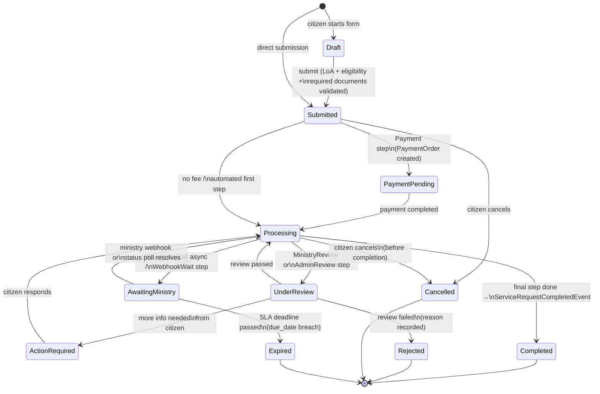
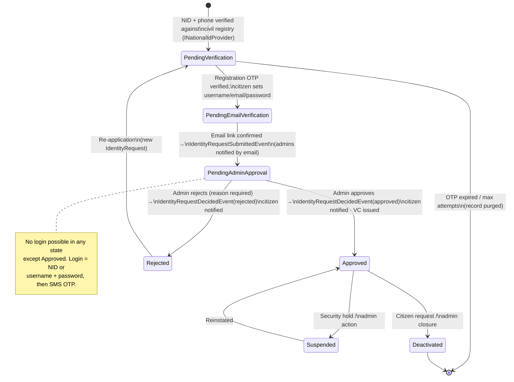
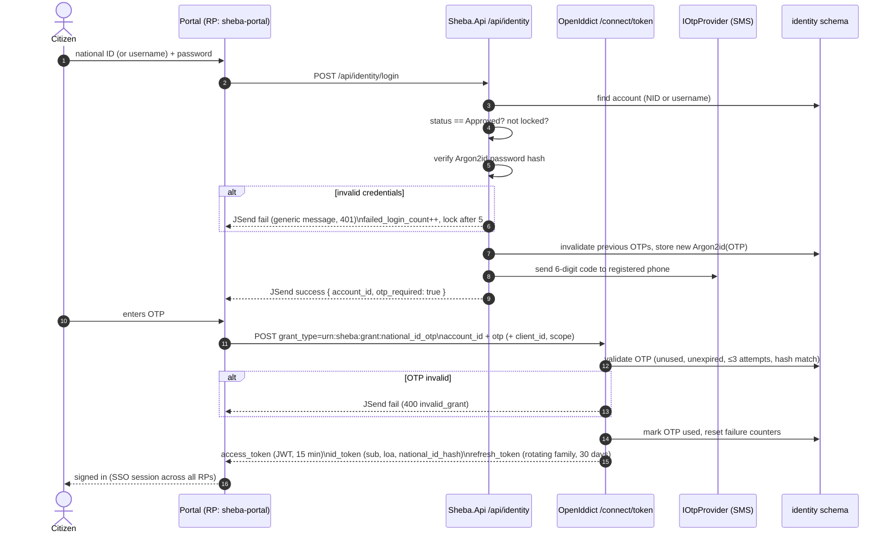
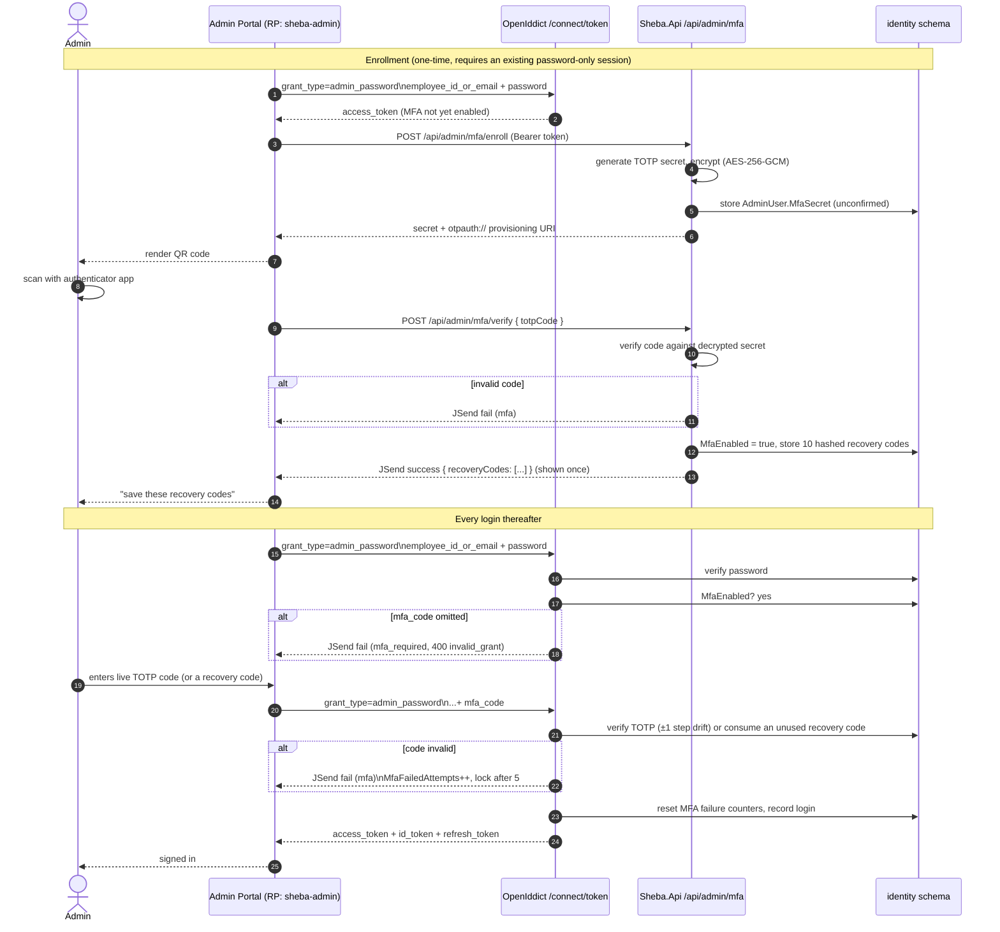
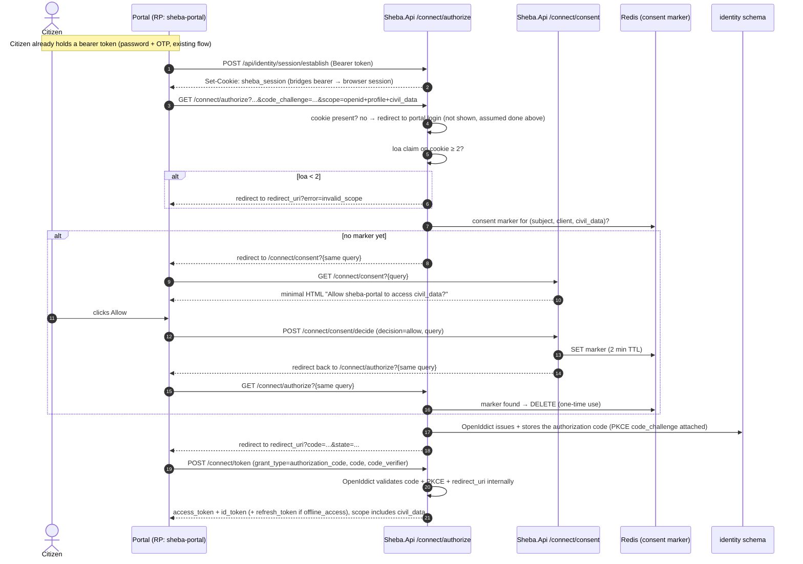
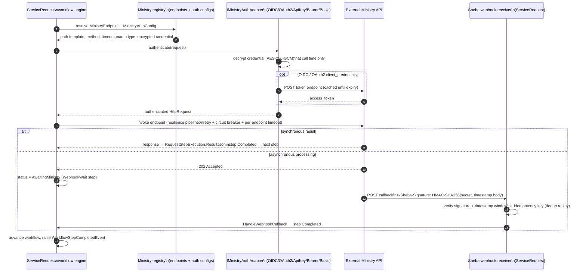

# Sheba — Master Architecture & Implementation Plan

> **The single source of truth for the Sheba e-Government platform.**
> Sibling documents under `docs/` are focused extracts of this file and must never contradict it.
> The previous plan, [SHEBA_ARCHITECTURE.md](archive/SHEBA_ARCHITECTURE.md), is archived and superseded.
>
> Status: **Target design.** The repository already implements most of this document; every known
> gap between this design and the code is tracked in [TASKS.md](../TASKS.md) and
> [known-issues.md](known-issues.md). Nothing in this document is aspirational hand-waving — each
> gap has an owner-ready backlog item.

**Document map:** [architecture.md](architecture.md) · [coding-standards.md](coding-standards.md) · [business-rules.md](business-rules.md) · [database-design.md](database-design.md) · [api-contract.md](api-contract.md) · [security.md](security.md) · [performance.md](performance.md) · [testing.md](testing.md) · [roadmap.md](roadmap.md) · [known-issues.md](known-issues.md)

---

## Table of Contents

1. [Assumptions & Open Questions](#1-assumptions--open-questions)
2. [Executive Summary](#2-executive-summary)
3. [Architecture Overview](#3-architecture-overview)
4. [Technology Stack](#4-technology-stack)
5. [Module-by-Module Design](#5-module-by-module-design)
6. [Identity Deep-Dive](#6-identity-deep-dive)
7. [Ministry Integration Framework](#7-ministry-integration-framework)
8. [Data Architecture](#8-data-architecture)
9. [API Response Standard (JSend)](#9-api-response-standard-jsend)
10. [Authorization Model](#10-authorization-model)
11. [Event-Driven Design](#11-event-driven-design)
12. [Dashboard / BI / Reporting Backend](#12-dashboard--bi--reporting-backend)
13. [Security & Threat Model](#13-security--threat-model)
14. [Deployment](#14-deployment)
15. [Design Patterns Applied](#15-design-patterns-applied)
16. [Implementation Roadmap](#16-implementation-roadmap)
17. [Requirements Traceability](#17-requirements-traceability)
18. [Risks & Mitigations](#18-risks--mitigations)

---

## 1. Assumptions & Open Questions

Stated per the "proceed with sensible defaults" instruction. Change any of these and the affected
sections are called out.

| # | Assumption | Basis | Affects |
|---|-----------|-------|---------|
| A1 | Stack: .NET 9 / C# 13, ASP.NET Core, EF Core, PostgreSQL 16, Redis 7, MinIO, OpenIddict, MediatR, Hangfire, Serilog + Seq, Docker Compose | Confirmed from the existing solution (`Sheba.sln`, `Directory.Packages.props`) | §4 |
| A2 | Scale: pilot/graduation scale — ~1,000 accounts, < 10 RPS sustained, ≤ 20 registered ministries — with a national-scale growth path designed in but not provisioned | Existing §24 guidance; single-server compose | §3.4, §14 |
| A3 | Hosting: single in-country server; no formal compliance regime exists for Yemen, so the bar is GDPR-inspired PII minimization + OWASP ASVS L2 practices | No Yemeni data-protection statute to target | §8.3, §13 |
| A4 | The real civil-registry API shape is unknown. The pluggable `INationalIdProvider` contract **is** the boundary; the mock provider with 8 seeded citizens is authoritative for development | Code (`MockNationalIdProvider`) | §6.5 |
| A5 | Connectivity: citizens may be on 2G/intermittent networks — OTP via SMS (not push), no mandatory app install, low-payload JSON APIs. Full offline service delivery is out of scope | Yemen infrastructure reality | §6, §18 |
| A6 | Payments are mock in this phase (no licensed national PSP integration assumed); the Payment module keeps a gateway-shaped seam | Code (`PaymentOrder` mock) | §5.7 |
| A7 | Docs in English; all citizen-facing entities carry `name_ar`/`name_en` bilingual fields | Existing schema | §8 |
| A8 | SAML RP support is deferred (adapter enum value exists; no implementation). OIDC covers all planned integrations | Old doc §24 override | §7.2 |

**Open questions** (tracked in [known-issues.md](known-issues.md)): real registry SLA & fallback
policy when the registry is down during onboarding; national SMS gateway contract; whether LoA3
(biometric/in-person) is in the first production release.

---

## 2. Executive Summary

Sheba is Yemen's e-Government platform: a **modular monolith** (one deployable, ten strictly
bounded modules) that is simultaneously the **national OpenID Connect / OAuth 2.1 Identity
Provider** (OpenIddict) and the **government service gateway**. Citizens who already exist in the
civil registry open a digital identity through an eKYC flow (national ID + registered phone match →
OTP → credentials → email verification → human admin approval), then sign in everywhere with
"Sign in with Sheba" — the same brokered-trust pattern UAE Pass and Singpass use, with GOV.UK-style
levels of assurance and Absher-style OTP-on-every-login. External ministries (Civil Registry,
Passports, Traffic, OpenCRVS…) plug in twice: as **relying parties** consuming Sheba identity, and
as **integration targets** that Sheba calls through a per-ministry credential vault and pluggable
auth adapters to fulfil catalogued government services via a step-based workflow engine. Everything
runs from one `docker compose up` today, and every module boundary is an extraction seam for
tomorrow.

---

## 3. Architecture Overview

### 3.1 Style: modular monolith, microservices-influenced

One ASP.NET Core 9 process (`Sheba.Api`), one PostgreSQL database, **ten modules** each owning its
own schema, domain model, application layer, and persistence. Modules behave like microservices in
every way except process boundaries:

- **No cross-module DB reads.** Each module has its own `DbContext` with `HasDefaultSchema(...)`;
  there are no FK constraints across schemas — cross-context references are plain IDs (§8.2).
- **No cross-module type references.** A module never imports another module's entities, DbContext,
  or handlers. The compiler enforces this: module projects reference only `Sheba.Shared.Kernel`.
- **Two sanctioned communication channels:**
  1. **In-process integration events** — MediatR `INotification`, made durable by the
     transactional outbox (§11).
  2. **Shared-kernel query/command ports** — narrow interfaces defined in
     `Sheba.Shared.Kernel.Interfaces` (e.g. `ICitizenAccountQueryService`,
     `IIdentityStatsProvider`, `IPaymentOrderPort`, `IMinistryCallPort`,
     `IMinistryWebhookVerifier`) and implemented by the owning module as an adapter — including
     ServiceRequest's dependency on Payment and Ministry, which used to be raw cross-module
     project references (T-ARC-1) and now goes through these ports like everything else.

This is the same discipline e-Estonia's X-Road enforces between ministries ("no direct database
sharing; standard interfaces only") applied inside one process.

### 3.2 System diagram

Source: [diagrams/architecture-overview.mmd](diagrams/architecture-overview.mmd)

```mermaid
flowchart TB
    subgraph Clients["External Consumers"]
        CIT["Citizen Portal (SPA)\nRP: sheba-portal"]
        ADM["Admin Dashboard (SPA)\nRP: sheba-admin"]
        RP["External Relying Parties\n'Sign in with Sheba'"]
        MIN_SYS["Ministry Systems\n(machine clients)"]
    end

    subgraph Host["Sheba.Api — single ASP.NET Core 9 process"]
        GW["Gateway concerns\nrouting · authN/Z · rate limiting\nJSend wrapping · correlation IDs"]
        subgraph Modules["Modules (in-process, strict boundaries)"]
            ID["Identity\nOpenIddict OIDC/OAuth2.1\neKYC · approvals · RPs"]
            CZ["Citizen\nprofiles"]
            MI["Ministry\nregistry · credentials\nauth adapters"]
            SR["ServiceRequest\ncatalog · workflow engine"]
            DO["Document\nMinIO storage"]
            WA["Wallet\nW3C VCs · DIDs"]
            PA["Payment\nfees · orders"]
            NO["Notification\nemail · SMS"]
            AU["Audit\nappend-only log"]
            AD["Admin\nKPIs · BI read model · reports"]
        end
        BUS["In-process event bus\nMediatR + Transactional Outbox"]
    end

    subgraph Data["Data plane (Docker Compose)"]
        PG[("PostgreSQL 16\none DB · schema per module")]
        RD[("Redis\nOTP throttle · cache")]
        MO[("MinIO\ndocuments · KYC files")]
        SEQ["Seq\nstructured logs"]
        HF["Hangfire\noutbox dispatch · reports"]
    end

    subgraph External["External Systems (pluggable adapters)"]
        NID["Civil Registry / NID\nINationalIdProvider"]
        MAPI["Ministry APIs\nOIDC · OAuth2 · API key\nbearer · basic"]
        SMS["SMS Gateway\nIOtpProvider"]
        SMTP["SMTP\n(MailHog in dev)"]
    end

    CIT --> GW
    ADM --> GW
    RP -->|"OIDC authorize/token"| GW
    MIN_SYS -->|"client_credentials + webhooks"| GW
    GW --> Modules
    Modules <--> BUS
    Modules --> PG
    ID --> RD
    DO --> MO
    Host --> SEQ
    HF --> BUS
    ID -.->|adapter| NID
    ID -.->|adapter| SMS
    NO -.-> SMTP
    NO -.->|adapter| SMS
    MI -.->|"credential vault + adapters"| MAPI
    SR -->|"via Ministry adapters"| MI
```



### 3.3 Module map

| Module | Schema | Route groups | Role |
|--------|--------|-------------|------|
| Identity | `identity` | `/api/identity`, `/connect/*`, `/api/admin/identity-requests`, `/api/admin/relying-parties`, `/api/admin/mfa`, `/api/admin/admin-users` | OIDC provider, eKYC, approvals, RP registry, admin MFA, admin provisioning |
| Citizen | `citizen` | `/api/citizens` | Extended citizen profile |
| Ministry | `ministry` | `/api/ministry` | Integration registry + credential vault |
| ServiceRequest | `service_req` | `/api/services`, `/api/requests`, `/api/admin/services`, `/api/admin/requests` | Catalog + workflow engine |
| Document | `document` | `/api/documents` | MinIO-backed file storage |
| Wallet | `wallet` | `/api/wallet` | W3C VCs, DIDs |
| Payment | `payment` | `/api/payments` | Fees, orders, (mock) gateway |
| Notification | `notification` | *(no public API — event-driven)* | Email/SMS delivery + log |
| Audit | `audit` | `/api/admin/audit` | Append-only audit trail |
| Admin | `admin_data` | `/api/admin` (+ Hangfire dashboard) | KPIs, BI read model, reports |
| Gateway | — | cross-cutting middleware | Routing, authN enforcement, rate limiting, JSend wrapping (§3.5) |

### 3.4 Migration path to services

The seams are the contracts: integration events (§11.2) and shared-kernel query interfaces. To
extract a module: (1) give it its own host + its schema moved to a dedicated DB, (2) swap the
in-process event bus for RabbitMQ/MassTransit behind the same outbox (the outbox dispatcher changes,
publishers/consumers don't), (3) replace shared-kernel query interfaces with HTTP/gRPC clients behind
the same interface.

**Extraction order (when scale demands it):**

1. **Notification** first — lowest coupling: consumes events, owns no upstream contract, failure
   is non-critical. A perfect dry run of the extraction machinery.
2. **Document** second — I/O-heavy (large uploads), scales on different axes (bandwidth/storage vs CPU).
3. **ServiceRequest + Ministry** together — the integration workload (slow external ministry calls)
   is the likeliest capacity bottleneck; they share the call path so they move as a pair.
4. **Identity last.** It is the trust anchor; everything validates its tokens. Keycloak-style
   dedicated-IdP topology is the end state, but extracting it early buys nothing and risks the
   crown jewels.

Gateway module note: in the monolith, "Gateway" is not a network hop — it is the ASP.NET Core
middleware pipeline (routing, auth enforcement, rate limiting, response wrapping, correlation IDs).
When the first module is extracted, these concerns move to a YARP reverse proxy container with the
same responsibilities. Designing it as a named module keeps that move mechanical.

### 3.5 Request pipeline (Gateway responsibilities)

```
HTTPS → ExceptionHandler (JSend error/fail) → Correlation ID (X-Correlation-Id, T-GW-1)
     → Serilog request logging → Rate limiter (T-SEC-2) → CORS (T-GW-1)
     → AuthN (OpenIddict validation) → AuthZ (policies) → JSend result wrapping
     → Module endpoint groups (minimal APIs) → MediatR pipeline:
        Logging → Validation (FluentValidation) → Authorization → Transaction+Outbox
        → Audit logging (T-AUD-4) → Handler
```

`CorrelationIdMiddleware` reuses an inbound `X-Correlation-Id` header if the caller sent one,
otherwise mints one from `HttpContext.TraceIdentifier`; it's pushed into the Serilog scope (every
log line for the request carries it) and echoed on the response. It runs immediately after
`ExceptionHandlerMiddleware` so the id is available to the 500 handler's `correlation_id` field
even when the exception originates deep in the pipeline. CORS is a named policy
(`Cors:AllowedOrigins` in config) with no wildcard — bearer tokens ride in headers set by JS
callers, so an explicit allow-list is required; an empty/missing list blocks all cross-origin
calls, which is the safe default for an unconfigured environment.

`AuditLoggingBehavior` (T-AUD-4) is the innermost MediatR behavior — registered after
`TransactionBehavior` so its own `audit.audit_events` write happens on its own `AuditDbContext`
after the business transaction resolves, never inside it (cross-schema, so no shared transaction
per rule 2). It intercepts every `*Command` (queries are skipped), takes the actor from the JWT
`sub` claim (`Guid.Empty` for anonymous calls), and snapshots the request/response through
`AuditSnapshotRedactor` — a redaction *allowlist*: only property names on an explicit safe list
are written verbatim, everything else (including any future field nobody has reviewed yet) is
replaced with `"[REDACTED]"`. A handler exception still produces a `Succeeded = false` audit row
before the audit behavior re-throws.

---

## 4. Technology Stack

| Technology | Version | One-line justification |
|-----------|---------|------------------------|
| .NET / ASP.NET Core | 9 / C# 13 | Confirmed in repo; LTS-adjacent, best-in-class perf, minimal APIs |
| OpenIddict | 5.x | Standards-complete OAuth 2.1/OIDC server on ASP.NET Core without Duende licensing; supports custom grants (needed for NID+OTP) |
| EF Core + Npgsql | 9 | Schema-per-module `DbContext`s, migrations as deployment artifacts |
| PostgreSQL | 16 | Single instance, ten schemas; JSONB for snapshots/schemas; battle-tested |
| Redis | 7 | OTP rate counters, distributed cache, future token-revocation list |
| MinIO | latest | S3-compatible object store for KYC documents; self-hostable (sovereignty) |
| MediatR | 12 | In-process commands/queries/events; pipeline behaviors for cross-cutting |
| Hangfire (+ PostgreSql storage) | 1.8 | Outbox dispatcher, scheduled reports, OTP purge — no extra broker needed |
| FluentValidation | 11 | Input validation feeding JSend `fail` envelopes |
| Serilog → Seq | — | Structured logs with correlation IDs, one-container log server |
| Isopoh Argon2id | — | Password + OTP hashing (memory-hard; OWASP password-storage guidance) |
| Microsoft.Extensions.Http.Resilience | 9 | Retry/circuit-breaker/timeout on ministry HTTP calls (Polly v8 under the hood) |
| QuestPDF / ClosedXML / CsvHelper | — | Report generation (PDF/Excel/CSV) |
| Swashbuckle (Swagger) | — | API exploration for examiners and RP developers |
| xUnit + FluentAssertions + NSubstitute + Testcontainers | — | Test stack (see [testing.md](testing.md)) |

**Runner-up noted:** Keycloak as an off-the-shelf IdP was rejected — Sheba's onboarding (registry
check + admin approval + custom OTP grant) is the product, not a plugin; OpenIddict keeps it in
first-party C#. RabbitMQ was deliberately deferred (§11.4).

---

## 5. Module-by-Module Design

Full ERDs with every column are rendered in [database-design.md](database-design.md); each section
links its diagram source.

### 5.1 Identity (IAM / OIDC) — the trust anchor

**Responsibilities:** OpenIddict authorization server; citizen account lifecycle (eKYC →
approval → active); admin users; relying-party registry; OTP issuance/verification; pluggable
NID + OTP providers; refresh-token families.

**Key entities:** `Account` (status machine, LoA, lockout), `IdentityRequest` (+ documents,
immutable registry snapshot JSON), `AdminUser` (role + TOTP secret), `RelyingParty`
(+ redirect URIs, scopes), `OtpRecord` (Argon2id hash, TTL 5 min, max 3 attempts),
`RefreshTokenFamily`, `ScopeDefinition`, `OutboxMessage`.

**Emits:** `AccountRegisteredEvent`, `IdentityRequestSubmittedEvent`, `IdentityRequestDecidedEvent`.
**Consumes:** none (root of the event graph).
**Public contract:** `/connect/*` (OIDC), `/api/identity/*` (onboarding + login), admin queues;
implements `ICitizenAccountQueryService` and `IIdentityStatsProvider` for other modules.
**ERD:** [diagrams/erd-identity.mmd](diagrams/erd-identity.mmd)

### 5.2 Citizen

**Responsibilities:** post-approval extended profile (address, DOB, governorate) — data the citizen
owns and edits, deliberately separated from the security-critical `Account`.
**Key entities:** `CitizenProfile` (1:1 logical ref to `identity.accounts`).
**Consumes:** `IdentityRequestDecidedEvent(approved)` → creates the profile.
**ERD:** [diagrams/erd-citizen.mmd](diagrams/erd-citizen.mmd)

### 5.3 Ministry — the integration backbone

See §7 for the full framework. **Key entities:** `Ministry` (recursive hierarchy),
`MinistryAuthConfig`, `MinistryAuthCredential` (encrypted vault), `MinistryEndpoint`,
`MinistryWebhook`.
**Public contract:** admin CRUD under `/api/ministry`; exposes `IMinistryRepository` +
`IMinistryAuthAdapter` resolution to ServiceRequest (in-process port, the one sanctioned
"deep" module dependency — documented as such because they extract together, §3.4).
**ERD:** [diagrams/erd-ministry.mmd](diagrams/erd-ministry.mmd)

### 5.4 ServiceRequest — catalog + workflow engine

**Responsibilities:** hierarchical service catalog (category → service → form schema, fees,
required documents, workflow steps) and the runtime request lifecycle driven by a step engine
(`IWorkflowStepHandler` per `WorkflowStepType`).
**Key entities:** `ServiceCategory`, `ServiceDefinition`, `ServiceFormSchema`, `ServiceFee`,
`ServiceRequiredDocument`, `ServiceWorkflowStep`, `ServiceRequestEntity`, `RequestStepExecution`.
**Emits:** `ServiceRequestSubmittedEvent`, `WorkflowStepCompletedEvent`,
`ServiceRequestCompletedEvent`.
**Consumes:** payment completion (via `MarkPaymentComplete` command today; `PaymentCompletedEvent`
in target design), ministry webhooks (`HandleWebhookCallback`).
**Lifecycle diagram:** [diagrams/service-request-lifecycle.mmd](diagrams/service-request-lifecycle.mmd) (rendered in §5.4.1)
**ERD:** [diagrams/erd-servicerequest.mmd](diagrams/erd-servicerequest.mmd)

#### 5.4.1 Request lifecycle



Every transition writes a `RequestStepExecution` row (who, when, result JSON, error) — the
per-request audit trail — and raises status events consumed by Notification and Admin.

### 5.5 Document

**Responsibilities:** file metadata + MinIO object storage; presigned download URLs; soft delete;
time-boxed access grants for reviewers. Virus scanning and per-object encryption keys are backlog
(T-DOC-1/2).
**Key entities:** `Document`, `DocumentAccessGrant`.
**ERD:** [diagrams/erd-document.mmd](diagrams/erd-document.mmd)

### 5.6 Wallet (W3C Verifiable Credentials)

**Responsibilities:** DID registry (`did:sheba:issuer`, `did:sheba:citizen:{id}`), credential
schema registry, VC issuance as signed JWT-VC (RSA JWS per W3C VC Data Model + JOSE securing
mechanism), revocation. On identity approval, `IssueCredentialOnApprovalHandler` automatically
issues a `DigitalIdentityCredential` — the Singpass-style "citizen holds their own attested data"
pattern.
**Key entities:** `DidDocument`, `CredentialSchema`, `VerifiableCredential`.
**Consumes:** `IdentityRequestDecidedEvent(approved)`.
**ERD:** [diagrams/erd-wallet.mmd](diagrams/erd-wallet.mmd)

### 5.7 Payment

**Responsibilities:** payment orders raised by the workflow `Payment` step; mock gateway now, real
PSP later behind the same `IPaymentGateway` seam (T-PAY-1 builds the currently-empty application
layer: CreateOrder/ConfirmPayment/Refund commands + `PaymentCompletedEvent`).
**Key entities:** `PaymentOrder`, `PaymentTransaction`.
**ERD:** [diagrams/erd-payment.mmd](diagrams/erd-payment.mmd)

### 5.8 Notification

**Responsibilities:** consume events and deliver email/SMS via provider abstractions
(`IEmailService`, `ISmsService`; console + MailHog in dev); append-only `NotificationRecord` log.
Templates (`NotificationTemplate`, bilingual) are backlog T-NOT-1.
**Consumes:** `IdentityRequestSubmittedEvent` (→ email all IdentityReviewer admins),
`IdentityRequestDecidedEvent` (→ email citizen), `ServiceRequestSubmittedEvent`/`CompletedEvent`
(→ notify citizen).
**ERD:** [diagrams/erd-notification.mmd](diagrams/erd-notification.mmd)

### 5.9 Audit

**Responsibilities:** append-only who/what/when/before-after log written by a MediatR pipeline
behavior for every state-changing command. Target design adds: INSERT-only DB grant (T-AUD-1),
SHA-256 hash chaining for tamper evidence (T-AUD-2, the same idea as Estonia's KSI-anchored logs,
minus the blockchain), and monthly partitioning (T-AUD-3).
**Key entities:** `AuditEvent`.
**ERD:** [diagrams/erd-audit.mmd](diagrams/erd-audit.mmd)

### 5.10 Admin (Dashboard/BI backend)

See §12. **Key entities:** `DailyRegistrationSnapshot`, `DailyServiceRequestSnapshot`, `ReportJob`.
**Consumes:** every domain event (read-model projections).
**ERD:** [diagrams/erd-admin.mmd](diagrams/erd-admin.mmd)

### 5.11 Gateway

No schema, no entities. Cross-cutting middleware set (§3.5) + the extraction seam to YARP (§3.4).

---

## 6. Identity Deep-Dive

### 6.1 OpenIddict configuration

| Concern | Value |
|---------|-------|
| Endpoints | `/connect/authorize`, `/connect/token`, `/connect/userinfo`, `/connect/introspect`, `/connect/revoke`, `/connect/logout`, `/.well-known/openid-configuration`, `/.well-known/jwks` |
| Grants | `authorization_code` + **PKCE required** (OAuth 2.1 removes implicit and mandates PKCE for public clients), `client_credentials` (machine/ministry), `refresh_token` (rotating), custom `urn:sheba:grant:national_id_otp` |
| Scopes | `openid profile email phone offline_access` + `civil_data` (registry claims, consent-gated), `ministry_api`, `admin_api` |
| Access token | JWT, RS256, **15 min** TTL. Encrypted (JWE) whenever `Identity:EncryptionCertificates` is configured — an external RP then holds an opaque blob, not a token it can read the claims of; Sheba.Api's own resource-server validation still decrypts it locally. Unencrypted when unconfigured, for `jwt.io` inspectability in dev (**T-SEC-5** closed). |
| Refresh token | 30 days, rotation on every use, family reuse-detection (§6.4) |
| ID token claims | `sub`, `name`, `preferred_username`, `email`, `national_id_hash` (SHA-256 — the raw NID never leaves the Identity module in a token), `loa` |
| Signing keys | Dev cert when unconfigured; config-driven multi-cert loading + overlap rotation runbook implemented (§13.4, §4.1, T-SEC-4 closed) — production still needs real certs provisioned into the store/mount |

**Why a custom grant instead of bending Resource Owner Password?** OAuth 2.1 drops the password
grant entirely; a named extension grant (`urn:sheba:grant:national_id_otp`) is the
standards-sanctioned way to model "password + phone OTP" as a first-class token request, and
OpenIddict supports custom grant handlers natively. UAE Pass and Singpass hide the same
multi-factor dance behind their `authorize` endpoint; Sheba does both — browser flows go through
`/connect/authorize` with PKCE, and the first-party portal uses the custom grant.

### 6.2 Citizen onboarding state machine

Source: [diagrams/citizen-onboarding-state.mmd](diagrams/citizen-onboarding-state.mmd)



**Flow rules** (full detail in [business-rules.md](business-rules.md)):

1. `RegisterCitizen`: NID + phone → `INationalIdProvider.VerifyCitizenAsync` checks *exists*,
   *phone matches*, *not deceased*, *not suspended*, *NID not expired*, *not already registered in
   Sheba*. Any failure returns one **generic** error (no enumeration oracle — the same reason
   GOV.UK One Login and UAE Pass never disclose which check failed). A registry data snapshot is
   frozen into `IdentityRequest.CitizenSnapshotJson` for the reviewer.
2. Registration OTP to the **registry-registered** phone (possession proof of the registry-bound
   number, not a citizen-supplied one).
3. `CompleteRegistration`: username + email + Argon2id(password) with zxcvbn-style strength check.
4. Email verification link (15 min, single-use) → status `PendingAdminApproval` →
   `IdentityRequestSubmittedEvent` → email to all `IdentityReviewer` admins.
5. Admin reviews snapshot + documents → Approve / Reject(reason). Decision →
   `IdentityRequestDecidedEvent` → citizen emailed; on approval the Wallet issues the identity VC.
6. **No login in any status except `Approved`.** This is the GOV.UK Verify lesson: gate account
   activation on vetting, not on self-service email confirmation.

### 6.3 Login flow (password + SMS OTP)

Source: [diagrams/login-otp-sequence.mmd](diagrams/login-otp-sequence.mmd)



Lockout: 5 failed passwords → exponential lock (`2^(n-4)` minutes). OTP: 6 digits from a CSPRNG
(`RandomNumberGenerator`), Argon2id-hashed at rest, 5-minute TTL, 3 attempts, previous OTPs
invalidated on re-issue, issuance rate-limited per account and per IP (§13.2).

### 6.4 Token lifecycle & revocation

- **Access tokens**: 15 min — short enough that revocation lag is bounded; RPs validate signature +
  `iss`/`aud`/`exp` locally via JWKS.
- **Refresh tokens**: rotation on every use (OpenIddict default). `RefreshTokenFamily` tracks the
  family: presenting a **superseded** token is treated as theft and revokes the entire family —
  the rotation + reuse-detection scheme recommended by the OAuth Security BCP (RFC 9700) for
  public clients (**T-SEC-9** closed). Mechanism: OpenIddict mints the actual refresh token after
  the endpoint returns, so currency is tracked by a monotonic `family_generation` claim (internal
  — no token destination, never appears in the JWT) rather than by hashing a raw token value this
  code never sees; a presented generation that doesn't match the family's current one revokes the
  whole family, not just that one request.
- **Logout / revocation**: `/connect/revoke` + `/connect/logout`; admin can force-revoke all
  families for an account (suspension path).

### 6.5 Pluggable national-ID provider

```csharp
public interface INationalIdProvider           // Identity.Domain port
{
    string ProviderCode { get; }               // "Mock" | "CivilRegistryHttp" | "OpenCrvs"
    Task<NidVerificationResult> VerifyCitizenAsync(string nationalId, string phoneNumber, CancellationToken ct);
    Task<CitizenNidRecord?> GetCitizenDataAsync(string nationalId, CancellationToken ct);
    Task<bool> IsAliveAsync(CancellationToken ct);
}
```

Selected by `NationalId:ActiveProvider` config (Options pattern). Implementations:
`MockNationalIdProvider` (dev; 8 seeded citizens covering every rejection branch — valid ×4,
deceased `1000000099`, suspended `1000000098`, expired `1000000097`, phone-mismatch `1000000096`),
`HttpNationalIdProvider` (named client `CivilRegistry` + resilience pipeline). An OpenCRVS adapter
is a planned third implementation (T-INT-1). Failure reasons (`NotFound`, `PhoneMismatch`,
`Deceased`, `Suspended`, `InvalidFormat`) are logged and audited internally, never returned to the
caller. Registry outage behavior: fail closed for onboarding (you cannot open an identity when the
authoritative source is unreachable), fail open for login (login never consults the registry).

### 6.6 Pluggable OTP provider

```csharp
public interface IOtpProvider                  // Identity.Domain port
{
    string ProviderCode { get; }               // "Console" | "Twilio" | future local gateways
    Task SendAsync(string phoneNumber, string code, OtpPurpose purpose, CancellationToken ct);
}
```

Selected by `Otp:ActiveProvider`. `ConsoleOtpProvider` (dev — logs the code), `TwilioOtpProvider`
(prod-shaped). Generation, hashing, TTL, attempts, and throttling are **provider-independent** —
they live in the application layer, so a provider can only deliver codes, never weaken policy.

### 6.7 Relying-party management ("Sign in with Sheba")

Admins register RPs at `/api/admin/relying-parties`. **OpenIddict's own application store is the
registry** — registration creates only the OpenIddict application (client id/secret, redirect
URIs, allowed scopes, client type) via `IOpenIddictApplicationManager`; the `RelyingParty`/
`RpRedirectUri`/`RpScope` domain entities in `Sheba.Identity.Domain` exist but are never written
to by these endpoints (a leftover from an earlier design that would have duplicated OpenIddict's
own tables — `RelyingPartyEndpoints.cs`'s own docstring explains the decision not to). Confidential
clients get secrets, rotatable on demand (`POST /{clientId}/rotate-secret`, T-OIDC-1 — the previous
secret stops working immediately, every other registered field is preserved); public clients
(SPAs, mobile) get PKCE-only, no secret. Sheba's own portal is RP `sheba-portal` (public + PKCE +
custom grant) and the admin dashboard is `sheba-admin` (confidential) — dogfooding the same SSO
everyone else uses, exactly as UAE Pass's own apps are ordinary RPs of the UAE Pass IdP. Scope
grants are per-RP allowlists; `civil_data` additionally requires citizen consent at the authorize
prompt and LoA ≥ 2 (Myinfo pattern: the citizen controls what data each RP receives) — mechanism
in [§6.10](sheba.md#610-browser-authorization-code--pkce-flow-with-consent-t-oidc-1).

### 6.8 Ministry / machine authentication (inbound)

Admin creates ministry system users as OpenIddict `client_credentials` clients scoped to
`ministry_api` (e.g. seeded `sheba-api-internal`). Static API keys / basic auth as *inbound*
credential types are supported for legacy ministry callers via the webhook receiver's per-ministry
verification (§7.4) — but token-based auth is the recommended default for anything that can hold a
secret and rotate it.

### 6.9 Admin TOTP enrollment & MFA gate (T-SEC-1)

Source: [diagrams/admin-mfa-sequence.mmd](diagrams/admin-mfa-sequence.mmd)



Enrollment is two self-service steps (`AnyAdmin` policy; the acting `AdminId` always comes from
the caller's own token `sub`, never a body/route parameter — one admin cannot enroll MFA on
another's account). `POST /api/admin/mfa/enroll` generates a 160-bit secret (Otp.NET: SHA1,
6 digits, 30-second step — the RFC 6238 defaults every mainstream authenticator app assumes) and
stores it encrypted (AES-256-GCM, the same primitive as Ministry's credential vault; the
encryptor is duplicated locally in Identity.Infrastructure rather than shared, per the
module-boundary rule that a module depends on Shared.Kernel only) but **unconfirmed** —
`AdminUser.MfaEnabled` stays `false` until `POST /api/admin/mfa/verify` proves the authenticator
app actually has the secret with a live code. Confirmation also issues 10 single-use recovery
codes (CSPRNG, Argon2id-hashed, shown exactly once) for a lost-device fallback.

Admins who have not yet enrolled keep the password-only baseline — enrollment itself requires an
authenticated admin token, so it cannot be a login precondition (this is the standard "opt-in
until enrolled, mandatory once enrolled" 2FA rollout pattern, not a policy gap). Once
`MfaEnabled` is `true`, the `admin_password` grant additionally requires a valid `mfa_code` (a
live TOTP code, or an unused recovery code) in the same token request as the password; a
missing/wrong code fails with a distinguishable JSend `fail` key (`mfa_required` vs `mfa`) —
revealing that a code is needed is safe here because it only happens after the password has
already been proven correct, unlike the pre-auth registration oracle BR-ON-3 guards against. Five
consecutive invalid MFA attempts lock the second factor for `2^(n-4)` minutes — the same
exponential formula BR-LG-3 uses for password lockout, applied to the new attack surface a
brute-forceable 6-digit code introduces.

### 6.10 Browser authorization-code + PKCE flow with consent (T-OIDC-1)

Source: [diagrams/authorize-consent-sequence.mmd](diagrams/authorize-consent-sequence.mmd)



`/connect/authorize` (`AuthorizeEndpoints`) sits behind the `EnableAuthorizationEndpointPassthrough()`
already configured for OpenIddict — PKCE itself needs no custom code: `RequireProofKeyForCodeExchange()`
makes OpenIddict validate `code_challenge`/`code_verifier` in its own pipeline before and after this
passthrough runs. What this endpoint adds is everything OAuth leaves to the authorization server's
own policy:

- **Session**: a separate, non-default cookie scheme (`SheebaSessionScheme`) distinct from the
  Bearer/OpenIddict-validation scheme every API call uses — naming it explicitly means no API
  caller is affected by its existence. `POST /api/identity/session/establish` bridges an existing
  bearer token (from the citizen's normal password+OTP login) into this cookie, since the browser
  redirect flow has no Authorization header to read. Not authenticated → redirect to the portal's
  login page (`Identity:PortalLoginUrl`) with a `return_url` back to the original request.
- **LoA gate**: `civil_data` in the requested scopes requires the cookie's `loa` claim ≥ 2, checked
  before anything else — an OAuth-shaped `error=invalid_scope` redirect to the RP's `redirect_uri`
  if not, never a bare 403 (an OIDC/OAuth error must reach the RP through its own channel, not a
  page the citizen's browser renders directly).
- **Consent**: a minimal server-rendered HTML prompt — deliberately the one place in this
  API-first backend that renders a page directly, because nothing else in the system exists to
  redirect to for it. Consent isn't persisted across sessions (no authorization-record store,
  no "remember forever"): a 2-minute one-time Redis marker (`sheba:consent:{subject}:{client}:civil_data`,
  mirroring the dedup pattern `MinistryWebhookVerifier` already uses) carries the decision from
  `POST /connect/consent/decide` back through a second pass of `/connect/authorize`, which is the
  only place actually able to call `Results.SignIn` against the OpenIddict authorization request
  (`/connect/consent` isn't a registered OpenIddict endpoint URI, so it has no such context).
  Denying redirects straight to the RP's `redirect_uri` with `error=access_denied` — never back
  through `/connect/authorize`, so a declined consent can't be retried by reloading.
- **First-party custom grant**: `urn:sheba:grant:national_id_otp` (§6.3) no longer defaults
  `civil_data` into its granted scopes — a caller must request it explicitly, and it's still
  refused below LoA 2 (`invalid_scope`). It does **not** run the consent step: `sheba-portal`
  using its own first-party grant isn't the "should a third party see this" decision consent
  exists for.

Verified live end-to-end against a running instance (not just unit-tested): cookie bridge → code
issued directly for `openid profile` → PKCE-verified token exchange; `civil_data` at LoA 1 →
`invalid_scope` redirect; `civil_data` at LoA 2 → consent redirect → Allow → code → token with
`civil_data` in its granted scope; no cookie → redirect to the configured login URL. This caught a
real gap during development: `/connect/token` had no `authorization_code` grant branch at all
(only the two custom grants + refresh_token) — the consent/PKCE plumbing was correct but nothing
could redeem the code it produced until that branch was added.

---

## 7. Ministry Integration Framework

The Ministry module is a **registry + credential vault**; the ServiceRequest workflow engine is the
**caller**. This split mirrors X-Road's separation between the central registry (who exists, what
they expose) and the security servers (who actually move messages).

### 7.1 Data model

```
Ministry (recursive tree: ministry → department → division)
 ├── MinistryAuthConfig   (named connection: auth type, base URL, timeouts, health path)
 │     └── MinistryAuthCredential (encrypted secrets for that connection, 1:1)
 ├── MinistryEndpoint     (method, path template, request/response JSON Schemas,
 │                         endpoint type, per-endpoint rate limit & consent flag)
 └── MinistryWebhook      (event type, receiver path, encrypted HMAC signing secret)
```

Full ERD: [diagrams/erd-ministry.mmd](diagrams/erd-ministry.mmd). Design points:

- **Config/credential split** — list/read configs without ever materializing secrets; credentials
  decrypt only inside auth adapters at call time.
- **Credential encryption: AES-256-GCM** (12-byte nonce ‖ ciphertext ‖ 16-byte tag, base64).
  This **supersedes old ADR-011 (RSA-OAEP)**, which was a design mistake: RSA-OAEP is a key-wrap
  primitive with size limits and no authenticated associated data — the wrong tool for bulk field
  encryption. Target hardening: key from secrets store + key-id prefix on ciphertext for rotation
  (T-SEC-3).
- **Endpoints carry contracts** — request/response JSON Schemas enable admin-side "try it" +
  server-side payload validation (T-SRV-2).
- `requires_citizen_consent` on endpoints feeds the consent prompt for `civil_data`-class calls.

### 7.2 Auth adapters (Strategy pattern)

`IMinistryAuthAdapter` implementations, one per `MinistryAuthType`: **Oidc**, **OAuth2**
(client_credentials with token caching in `cached_access_token` until expiry), **ApiKey**
(header/query/cookie placement), **BearerToken**, **BasicAuth**, plus **None**. `Custom` is an open
extension point; `Saml` is enum-reserved, implementation deferred (A8). Every adapter exposes
`TestConnectionAsync` → the admin dashboard's per-ministry health/status.

### 7.3 Outbound call flow

Source: [diagrams/ministry-integration-flow.mmd](diagrams/ministry-integration-flow.mmd)



Resilience: the `MinistryClient` named `HttpClient` uses the standard resilience handler (retry
with exponential backoff + circuit breaker + total-timeout) with the endpoint's own
`timeout_seconds` as the per-attempt bound. Circuit-open → step marked `Failed`, request routed to
`on_failure_step` or `ActionRequired`. Every call is logged (path, status, duration — request
bodies hashed, not stored, to keep PII out of logs).

### 7.4 Inbound webhooks — verification contract

Ministries call back at the registered `sheba_webhook_path`. Required headers:

| Header | Content |
|--------|---------|
| `X-Sheba-Signature` | `HMAC-SHA256(signing_secret, timestamp + "." + raw_body)`, hex |
| `X-Sheba-Timestamp` | Unix seconds; rejected if outside ±5 min window |
| `X-Sheba-Delivery-Id` | Ministry-generated UUID; deduplicated (idempotency) |

Verification order: signature (constant-time compare) → timestamp window → delivery-id dedup →
then processing. Rejected receipts are never persisted with the raw body or signing secret; each
rejection is logged as a structured warning (ministry id, rejection status, reason) for alerting —
this is the Stripe/GitHub webhook model, chosen because it is the most widely implemented pattern
ministry developers will already know. (Timestamp + dedup close the replay hole that
signature-only schemes leave open — implemented in `MinistryWebhookVerifier`, T-SRV-1.)

---

## 8. Data Architecture

### 8.1 Normalization approach

Write model is 3NF: every non-key attribute depends on the key (fees, redirect URIs, scopes,
required documents, workflow steps all normalized into child tables rather than arrays/JSON).
Deliberate, justified denormalizations:

| Denormalization | Why |
|-----------------|-----|
| `citizen_snapshot_json` on identity requests | Point-in-time evidence must be immutable even if the registry changes — legal audit trail, not a lookup table |
| `form_data_json` / `result_json` / JSON Schemas | Per-service dynamic shapes; schema-per-service tables would be unbounded DDL |
| `claims_json` beside the VC JWT | Read-fast copy of data whose source of truth is the signed JWT itself |
| `citizen.citizen_profiles.national_id/full_name*` | Read copy across a context boundary; owner remains `identity.accounts` |
| `admin_data.*` snapshots | The BI read model is denormalized by definition (§12) |

### 8.2 Cross-context references

**IDs only, never FKs, across schemas.** `service_req.service_requests.citizen_id` is a bare UUID;
integrity across contexts is maintained by events + idempotent consumers, not constraints — the
same rule that lets a module extract without a schema migration. Inside a schema, real FKs and
unique constraints apply.

### 8.3 PII & encryption map

| Location | PII | Protection |
|----------|-----|-----------|
| `identity.accounts` | NID, phone, names, email | TLS in transit; Argon2id for password; `national_id_hash` (not raw NID) in tokens; DB volume encryption at rest (T-SEC-6) |
| `identity.identity_requests.citizen_snapshot_json` | Full registry record | Same; retention: keep while account exists, purge N years after closure (default 10 — assumption A3) |
| `identity.otp_records` | Code hash + IP/UA | Argon2id; purged after use/expiry (Hangfire cleanup job) |
| `ministry.ministry_auth_credentials`, `ministry_webhooks.signing_secret` | Ministry secrets | **AES-256-GCM application-level encryption** (§7.1) |
| `service_req.service_requests.form_data_json` | Citizen submissions | Column-level AES-GCM planned (T-SEC-7); access restricted by ownership policy |
| `document.*` + MinIO objects | KYC images | Presigned URLs (short TTL); MinIO SSE (T-DOC-2); soft-delete only |
| Logs (Seq) | — | No PII policy: NIDs/phones/OTPs never logged; request bodies hashed in ministry call logs |

Full per-table detail: [database-design.md](database-design.md).

### 8.4 Migrations

EF Core migrations are the only sanctioned schema-change mechanism (**T-DB-1**, implemented). All
ten contexts (Identity, Citizen, Ministry, ServiceRequest, Document, Wallet, Payment, Notification,
Audit, Admin) ship an `InitialCreate` migration under their `Persistence/Migrations/` folder; the
`EnsureCreated()` fallback has been removed from `MigrateAllModulesAsync`, so a context without
migrations is now a build-time defect rather than a silent no-op. `MigrateAllModulesAsync` at
startup applies each module's migrations independently, verified against a clean-volume
`docker compose up`.

---

## 9. API Response Standard (JSend)

Every REST endpoint returns a [JSend](https://github.com/omniti-labs/jsend) envelope. JSend carries
the **application-level** outcome; the HTTP status code carries the **transport-level** outcome.
Both are always set; neither substitutes for the other. Full contract + endpoint catalog:
[api-contract.md](api-contract.md).

> **Status:** implemented (T-API-1). `JSendResponse<T>` + `JSend` factories live in
> `Sheba.Shared.Kernel/Responses/`; every module route group registers `JSendWrappingFilter`;
> the global exception middleware emits JSend `fail`/`error` (and OAuth error JSON on exempt
> OIDC routes); bare 401/403 challenges are rewritten to JSend `fail` bodies; Swagger documents
> the envelope via `JSendOperationFilter`.

### 9.1 The three envelopes

| Status | When | Required keys |
|--------|------|---------------|
| `success` | The call worked | `status`, `data` (may be `null`, e.g. DELETE) |
| `fail` | Client-side problem: validation, unmet precondition, missing auth | `status`, `data` (keys mirror offending fields) |
| `error` | Server-side failure while processing | `status`, `message` (+ optional `code`, `data`) |

### 9.2 JSend → HTTP mapping

| JSend | HTTP | Cases |
|-------|------|-------|
| `success` | 200 | reads, updates |
| `success` | 201 | resource created (+ `Location`) |
| `success` | 204→200 | prefer 200 with `data: null` so the envelope survives |
| `fail` | 400 | malformed input, validation failure |
| `fail` | 401 | unauthenticated (challenge still emits a JSend `fail` body) |
| `fail` | 403 | authenticated but forbidden |
| `fail` | 404 | resource not found |
| `fail` | 409 | conflict (duplicate username, state conflict) |
| `fail` | 422 | semantically invalid (domain rule violated) |
| `error` | 500 | unhandled exception |
| `error` | 502/503 | upstream ministry/registry failure surfaced to caller |

### 9.3 Implementation: one wrapper, zero hand-rolled envelopes

- `JSendResponse<T>` type + `JSend.Success(data)/Fail(dataDict)/Error(message, code)` factories in
  `Sheba.Shared.Kernel/Responses/`.
- An **endpoint result filter** on every module route group wraps handler DTOs into `success`
  envelopes — controllers/endpoints never build envelopes by hand.
- The **global exception middleware** maps: `ValidationException` → 400 `fail` (field-keyed
  dictionary from FluentValidation), `NotFoundException` → 404 `fail`, `DomainException` → 422
  `fail`, `UnauthorizedAccessException` → 403 `fail`, everything else → 500 `error` (correlation id
  in `data.correlation_id`, no stack traces).
- OIDC protocol endpoints (`/connect/*`, `/.well-known/*`) are **exempt** — they must speak
  RFC-mandated OAuth/OIDC response shapes, not JSend.

### 9.4 Worked examples

```jsonc
// 200 — GET /api/requests/{id}
{ "status": "success",
  "data": { "request": {
      "id": "6f1c…", "referenceNumber": "SHB-2026-4A9F21",
      "status": "AwaitingMinistry", "serviceCode": "PASSPORT_RENEW",
      "submittedAt": "2026-07-16T09:12:03Z", "dueDate": "2026-07-30T00:00:00Z" } } }

// 400 — POST /api/identity/register (validation fail)
{ "status": "fail",
  "data": { "nationalId": "National ID must be exactly 10 digits.",
            "phoneNumber": "Phone number must be in +967 format." } }

// 500 — ministry call exploded mid-workflow
{ "status": "error",
  "message": "An unexpected error occurred while processing the request.",
  "code": 5001,
  "data": { "correlation_id": "0HN4V2F3K8Q0J" } }
```

---

## 10. Authorization Model

RBAC via role claims in the JWT, enforced by ASP.NET Core authorization policies on route groups,
plus **resource-ownership checks in handlers** (a citizen can only touch `citizen_id == sub`
resources; a Ministry Admin only `ministry_id == their ministry` resources — plain RBAC cannot
express "own ministry only").

### 10.1 Roles

- **System Admin** (`SuperAdmin`) — full permissions; is *also a citizen* (holds a citizen account
  for personal use; the admin identity is a separate `AdminUser` — one human, two principals, so
  admin privilege never rides on a citizen token). Creates all other admins.
- Specialized admin sub-roles (already in code, kept): `IdentityReviewer`, `MinistryManager`,
  `Auditor`, `Support` — least-privilege slices of System Admin.
- **Ministry Admin** — manages exactly one ministry: its data, endpoints, credentials, webhooks,
  and the services it offers. (`MinistryManager` scoped to a `ministry_id` claim.)
- **Citizen** — own profile, wallet, documents, service requests.
- **Machine (RP / ministry system)** — scope-based only (`ministry_api`), no human role.

### 10.2 Permission matrix

| Capability | System Admin | Ministry Admin | IdentityReviewer | Auditor | Citizen |
|---|:-:|:-:|:-:|:-:|:-:|
| Create admin users | ✅ | ❌ | ❌ | ❌ | ❌ |
| Approve/reject identity requests | ✅ | ❌ | ✅ | ❌ | ❌ |
| Register/manage relying parties | ✅ | ❌ | ❌ | ❌ | ❌ |
| Create/edit any ministry + credentials | ✅ | own ministry only | ❌ | ❌ | ❌ |
| Manage ministry endpoints & webhooks | ✅ | own ministry only | ❌ | ❌ | ❌ |
| Create/publish services in catalog | ✅ | own ministry's services | ❌ | ❌ | ❌ |
| Review service requests (admin steps) | ✅ | own ministry's requests | ❌ | ❌ | ❌ |
| View KPIs / generate reports | ✅ | own ministry slice | ❌ | ✅ (read-only) | ❌ |
| Read audit log | ✅ | ❌ | ❌ | ✅ | ❌ |
| Suspend/reactivate citizen account | ✅ | ❌ | ✅ | ❌ | ❌ |
| Edit own profile / wallet / documents | ✅ (as citizen) | — | — | — | ✅ |
| Submit/cancel own service requests | ✅ (as citizen) | — | — | — | ✅ |
| Pay own fees | — | — | — | — | ✅ |

**T-AUTH-1 closed** for the rows TASKS.md scoped it to: `ministry_id` is a claim on the
MinistryManager's token (set at admin-account creation — `POST /api/admin/admin-users`,
SuperAdmin-only), enforced by `MinistryOwnershipFilter` on every `/api/ministry/{id}/...` route and
by handler-level checks on the ServiceRequest admin routes (`CreateServiceDefinition` forces the
body's ministryId to the caller's own; `UpdateServiceDefinition`/`SetServiceFee` 404 — not 403, to
avoid leaking which service IDs exist outside the caller's ministry — on a cross-ministry attempt;
`GetAllRequests`' `ministryId` filter is forced the same way). SuperAdmin's ministry_id-less token
remains unrestricted throughout.

**T-AUTH-3 closed** for the "View KPIs / generate reports — own ministry slice" row: `GetKpiSummary`,
`GetServiceRequestTrends`, the service-requests Excel/CSV report generators, and the excel branch of
the identity-requests report endpoint all take an optional `ministryId` — `AdminEndpoints` passes
`user.GetMinistryId()`, so a MinistryManager's token narrows every service-request-based figure to
their own ministry (`DailyServiceRequestSnapshot` carries `MinistryId`) while a null claim
(SuperAdmin/Auditor) sees the global aggregate, matching the existing `GetAllRequests` pattern.
**Deliberately still global:** `TotalAccounts`, `PendingIdentityRequests`,
`AvgApprovalHoursLast30Days`, registration trends, and the identity-requests PDF/CSV — these are
built from `DailyRegistrationSnapshot` and `IIdentityStatsProvider`, and identity requests are not
ministry-owned entities, so there is no slice to apply. Role-policy coverage itself was the
separate, already-closed **T-AUTH-2**.

---

## 11. Event-Driven Design

### 11.1 Transactional outbox (the reliability backbone)

**Status: implemented (T-EVT-1).** `OutboxMessage`/`InboxMessage` live in `Sheba.Shared.Kernel.Outbox`,
mapped into every module's own schema (one `outbox_messages` + `inbox_messages` table per module —
never a shared table). A `SaveChangesInterceptor` (`OutboxSaveChangesInterceptor`, registered on
every module's `DbContext`) converts each tracked aggregate's raised domain events into outbox rows
in the *same* `SaveChanges` call as the aggregate write — this replaced the old pattern of
publishing events in-process at SaveChanges, which had no durability (a crash between publish and
commit could fire a handler for state that never landed).

A single Hangfire recurring job (`OutboxDispatcherJob` in `Sheba.Api`, id `outbox-dispatcher`) polls
every module's outbox table for `Pending`/`Failed` rows whose `next_attempt_at` has elapsed,
deserializes the event by its stored CLR type name, publishes it through MediatR `IPublisher`, and
marks it `Published`. Failures increment `attempts` with exponential backoff and flip to
`DeadLettered` after 8 attempts. Hangfire's native recurring-job scheduler has no sub-minute cron
granularity, so the job is scheduled every minute and internally re-polls every 5 s for the rest of
its window — this hits the "5 s poll" target without the risk of self-rescheduling job chains
accumulating across app restarts (Hangfire recurring jobs dedup by id).

Consumers get an **inbox table** (`InboxMessage`, keyed by `(EventId, ConsumerName)`) for
idempotency — at-least-once delivery means a retried event redelivers to *every* handler, not just
the ones that previously failed, so each handler with a side effect checks/marks its own inbox row
via `IInboxGuard` before/after doing its work. `IUnitOfWork` also went from an unregistered
interface to a real `EfUnitOfWork<TContext>` per module, so `TransactionBehavior` now wraps
`ITransactionalCommand` handlers in an actual DB transaction instead of silently no-oping.

A supporting fix: the six domain event records (`AccountRegisteredEvent`,
`IdentityRequestSubmittedEvent`, `IdentityRequestDecidedEvent`, `ServiceRequestSubmittedEvent`,
`WorkflowStepCompletedEvent`, `ServiceRequestCompletedEvent`) exposed `EventId`/`OccurredAt` as
get-only properties with no setter — `System.Text.Json` silently minted a *new* `EventId` on
deserialization instead of restoring the original one, which would have broken inbox idempotency
outright. Changed to `init` accessors so the outbox round-trip preserves identity.

### 11.2 Integration event catalog

| Event | Producer | Consumers | Purpose |
|-------|----------|-----------|---------|
| `AccountRegisteredEvent` | Identity | Audit | NID check passed, account shell created |
| `IdentityRequestSubmittedEvent` | Identity | Notification (→ reviewer admins), Admin (BI) | Registration completed; review needed |
| `IdentityRequestDecidedEvent` | Identity | Notification (→ citizen), Citizen (create profile), Wallet (issue VC), Admin (BI) | Approval/rejection fan-out |
| `ServiceRequestSubmittedEvent` | ServiceRequest | Notification, Admin (BI) | New request |
| `WorkflowStepCompletedEvent` | ServiceRequest | Admin (BI) | Step progress |
| `ServiceRequestCompletedEvent` | ServiceRequest | Notification, Admin (BI) | Fulfilment |
| `PaymentCompletedEvent` *(planned, T-PAY-1)* | Payment | ServiceRequest (resume workflow), Admin | Replaces direct `MarkPaymentComplete` coupling |
| `CredentialIssuedEvent` *(planned)* | Wallet | Notification, Admin | VC issuance notice |
| `MinistryWebhookReceivedEvent` *(planned)* | ServiceRequest | Audit | Signed callback receipt trail |

Naming: `<Aggregate><PastTenseVerb>Event`; payloads carry IDs + minimal facts, never full PII
records (consumers query via shared-kernel ports if they need more). **Contract location:** an
event with a cross-module consumer is declared in `Sheba.Shared.Kernel.Events.IntegrationEvents`
— never in the producer's Domain assembly — so consumers can subscribe without referencing the
producer project. `IdentityRequestDecidedEvent`, `ServiceRequestSubmittedEvent`, and
`ServiceRequestCompletedEvent` moved there under T-ARC-1 (the 2026-07 audit found them still in
producer Domains, forcing illegal cross-module references). `AccountRegisteredEvent`,
`IdentityRequestSubmittedEvent`, and `WorkflowStepCompletedEvent` have no cross-module subscriber
today and stay in their producer's Domain assembly — they move out only if/when one gains one
(Notification's identity-review and citizen-notification consumers are still open, T-NOT-2).

### 11.3 Sagas vs. step engine

Long-running flows use the **persisted step engine** (`ServiceWorkflowStep` × `RequestStepExecution`),
not a saga framework — the workflow *definition* is admin-authored data, which a code-defined saga
cannot express. Compensation = explicit `on_failure_step` branches. This keeps ADR-008 from the
original doc.

### 11.4 Transport evolution

In-process MediatR today (right-sized: one process, no network partitions to survive). The outbox
is the swap point: moving to RabbitMQ/MassTransit changes only the dispatcher's publish call and
adds consumer endpoints — producers, consumers, and the event contracts are untouched.

---

## 12. Dashboard / BI / Reporting Backend

**Chosen approach: event-fed read model** in `admin_data` (`DailyRegistrationSnapshot`,
`DailyServiceRequestSnapshot` projections updated by event handlers; `ReportJob` for QuestPDF /
ClosedXML / CsvHelper exports via Hangfire; scheduled snapshot job for end-of-day counters).

**Why over materialized views (runner-up):** matviews would query across module schemas, silently
re-coupling every module at the SQL layer and breaking the extraction story — the read model
consumes the same integration events any extracted service would, so the BI backend survives
module extraction unchanged. Cost: eventual consistency (seconds) and projection-rebuild tooling
(T-ADM-1: replay-from-outbox rebuild command). At national scale the same events feed a real
warehouse instead.

KPIs served: registrations/approvals/rejections per day, approval latency, requests per
service/ministry, completion latency, SLA breaches, per-ministry health (from adapter
`TestConnectionAsync`). Endpoints under `/api/admin` (`GetKpiSummary`, time-series queries, report
CRUD + download).

---

## 13. Security & Threat Model

Full detail: [security.md](security.md).

### 13.1 Secrets management

Dev: user-secrets / compose env. Prod target (T-SEC-3): mounted secrets store (Vault or
cloud KMS equivalent); the AES credential-vault key and OpenIddict signing certs never live in
appsettings or images. Ciphertexts carry a key-id prefix so vault keys rotate without mass
re-encryption.

### 13.2 Brute-force & OTP-abuse protection

- Password: 5 failures → exponential lock (account) + per-IP limiter.
- OTP: 3 verification attempts per code; issuance capped (3 per 15 min per account, per-IP cap via
  Redis counters); previous codes invalidated on re-issue; codes are CSPRNG, hashed, 5-min TTL.
- ASP.NET Core `RateLimiter` policies (T-SEC-2, implemented): Redis-backed sliding-window-log
  limiters — `/api/identity/register` (5/5 min), `/api/identity/login` +
  `/api/identity/login/verify-otp` (10/5 min), `/api/identity/verify-otp` (10/5 min),
  `/connect/token` (30/min) — plus an in-memory global fallback (300/min per IP) on everything
  else. Partitioned by caller IP via a Lua script (`ZREMRANGEBYSCORE`/`ZCARD`/`ZADD`/`PEXPIRE` on a
  per-partition sorted set) so the trim-count-add is atomic under concurrent requests and the
  counters survive process restarts / would coordinate correctly across future horizontal
  instances. 429s render as JSend `fail` (key `rate_limit`) with a `Retry-After` header on every
  route except `/connect/*`, which gets an OAuth-shaped `{"error":"slow_down", ...}` body instead,
  matching the same wire-format exemption the exception middleware uses for OIDC routes.

### 13.3 Webhook replay protection

HMAC-SHA256 + timestamp window + delivery-id dedup (§7.4).

### 13.4 Key & token lifecycle

JWKS-published signing keys rotate by overlap: introduce new cert, publish both, sign with new,
retire old after max token lifetime (OpenIddict supports multiple registered certs natively).
Refresh-token families with reuse-revocation (§6.4). Access tokens 15 min. Admin sessions:
mandatory TOTP once enrolled (secret stored encrypted; self-service enrollment + recovery codes,
§6.9 — T-SEC-1 closed).

### 13.5 STRIDE summary (auth flows)

| Threat | Vector | Mitigation |
|--------|--------|-----------|
| **S**poofing | Register with someone else's NID | Registry phone match + OTP to registry-bound phone + human review + generic errors |
| | Stolen password | Mandatory OTP second factor; lockout |
| | Forged webhook | Per-ministry HMAC + timestamp + dedup |
| **T**ampering | Token forgery | RS256 signatures, JWKS, 15-min TTL |
| | Audit rewrite | INSERT-only grant + hash chaining (T-AUD-1/2) |
| | Credential vault edit | AES-GCM is authenticated encryption — tamper = decrypt failure |
| **R**epudiation | "I never approved that" | Audit rows carry actor, IP, before/after snapshots; admin actions always attributed |
| **I**nfo disclosure | Registration oracle (does NID X exist?) | Single generic failure message + rate limiting |
| | NID in tokens/logs | `national_id_hash` only; no-PII logging policy |
| | Ministry secrets | Encrypted at rest, decrypted only in adapters, never serialized outbound |
| **D**oS | OTP SMS flooding (cost attack) | Issuance caps per account/IP; provider budget alarms |
| | Login/token stuffing | Rate limiter + lockout |
| **E**levation | Citizen → admin | Separate principals (AdminUser ≠ Account), separate token audiences, policy checks server-side |
| | RP scope creep | Per-RP scope allowlist; `civil_data` consent + LoA gate |
| | Replayed refresh token | Family reuse-detection revokes the family |

### 13.6 Input validation

FluentValidation at the MediatR pipeline (every command), JSON Schema validation for dynamic
service forms (implemented — T-SRV-2), path-template variable whitelisting for ministry calls (no request-forgery
via admin-entered templates — URLs are built from registered base URL + template, never from
citizen input).

---

## 14. Deployment

### 14.1 Docker Compose topology (today — matches `docker-compose.yml`)

| Container | Image | Ports | Purpose |
|-----------|-------|-------|---------|
| `sheba-api` | build `src/Sheba.Api/Dockerfile` | 5000→8080 | The monolith |
| `postgres` | postgres:16-alpine | 5432 | One DB `sheba`, ten schemas |
| `redis` | redis:7-alpine | 6379 | Cache + counters |
| `minio` | minio/minio | 9000/9001 | Object storage |
| `mailhog` | mailhog/mailhog | 1025/8025 | Dev SMTP + inbox UI |
| `seq` | datalust/seq | 5341/8081 | Log server |

Dev defaults: `NationalId__ActiveProvider=Mock`, `Otp__ActiveProvider=Console`. Startup runs
per-module migrations + seeding (admin `ADMIN001`, OIDC clients, mock citizens, sample catalog) and
tolerates a cold DB.

**Production deltas on the same single server:** reverse proxy (Caddy/Nginx) for TLS termination in
front of `sheba-api`; Postgres nightly `pg_dump` + WAL archiving to off-box storage; Docker secrets
instead of env vars; MailHog → real SMTP relay; `Mock` → `CivilRegistryHttp`; Console → SMS
provider.

### 14.2 Single server today, split tomorrow

Scale ladder: (1) vertical + read replicas; (2) YARP container assumes Gateway; (3) extract modules
in §3.4 order — each takes its schema to its own DB and joins the broker; (4) Kubernetes only when
container count justifies it. Nothing in the design has to be rewritten at any rung — that is the
point of the boundaries.

---

## 15. Design Patterns Applied

| Pattern | Where | Why (not cargo-cult) |
|---------|-------|----------------------|
| Modular monolith + bounded contexts | 10 modules, schema-per-module | Microservice seams without distributed-systems tax at pilot scale |
| DDD tactical (aggregates, factories, domain events, value objects) | All Domain projects (`Account.CreateFromNidCheck`, `Email`, `NationalId`…) | Invariants enforced in one place; state machines live on aggregates |
| CQRS (logical split) | MediatR commands vs queries per module | Separate validation/transaction paths; queries stay allocation-light. No separate read DB — unwarranted at this scale except the BI read model |
| Mediator | MediatR + pipeline behaviors | One seam for logging/validation/authz/transaction/outbox on every use case |
| Repository + Unit of Work | Per-module repositories; UoW = EF transaction in TransactionBehavior | Domain stays persistence-ignorant; outbox rides the same transaction |
| Transactional Outbox | Kernel primitives + Hangfire dispatcher (T-EVT-1, implemented) | Atomic state+event; survives crash between commit and publish |
| Strategy / Provider | `INationalIdProvider`, `IOtpProvider`, `IMinistryAuthAdapter`, `IPaymentGateway` | Config-selected implementations; dev mocks are first-class |
| Adapter / Anti-Corruption Layer | Ministry auth adapters + `HttpNationalIdProvider` | External protocol shapes never leak into domain models |
| Observer | Webhook receipts; MediatR notification handlers | Ministries push instead of Sheba polling |
| Result → JSend translation | Endpoint filter + exception middleware (T-API-1) | Uniform envelopes; no hand-rolled responses |
| Options pattern | `NationalId:*`, `Otp:*`, `Ministry:EncryptionKey`, OpenIddict config | Typed, validated config; provider switching without code edits |
| Step-based process manager | `ServiceWorkflowStep` engine | Admin-authored workflows as data; explicit failure branches (vs. code-bound sagas) |

Error-flow note (T-STD-1, implemented): `Sheba.Shared.Kernel.Results` holds `Result`/`Result<T>` +
`Error`/`ErrorType`, adopted module-wide in Identity — all 12 command/query handlers return a
`Result<T>` for expected failures (validation, not-found, business-rule conflicts) instead of
throwing. `ResultHttpExtensions.ToHttpResult()` translates a `Result<T>` into the *same* JSend
shape and HTTP status the exception middleware already produces for the equivalent exception type
(`ErrorType.Validation`→400, `.NotFound`→404, `.Conflict`→422, `.Unauthorized`→403), so endpoints
collapse to one line — `return result.ToHttpResult();` — with no per-endpoint success/failure
branching. One deliberate shape fix along the way: four handlers (`VerifyOtp`, `VerifyLoginOtp`,
`LoginCitizen`, `VerifyEmail`) previously returned an ad-hoc `{succeeded, message}` DTO as the
`fail` envelope's `data` on failure; they now render the same field-keyed dict every other `fail`
response uses (e.g. `{"otp": "..."}`), consistent with [api-contract.md](api-contract.md). The
OIDC token-issuance path (`OidcEndpoints.IssueCitizenTokenAsync` / `IssueAdminTokenAsync`, which
consume `VerifyLoginOtpCommand` / `LoginAdminCommand`) checks `result.IsFailure` /
`result.Error!.Message` directly and keeps speaking OAuth error JSON — `Result<T>` has one
producer per handler but each consumer renders it in its own wire format. Other modules still
throw `DomainException` et al.; adopt Result the same way, one module per pass, never mixing
styles within a module.

---

## 16. Implementation Roadmap

Dependency-respecting build order (Identity ⟶ everything; Ministry ⟶ ServiceRequest;
events ⟶ Notification/Admin/Wallet). Full phase detail: [roadmap.md](roadmap.md);
task-level checklist: [TASKS.md](../TASKS.md).

| Phase | Scope | Exit criteria |
|-------|-------|---------------|
| **0 — Hardening the base** *(complete)* | ~~JSend wrapper (T-API-1)~~, ~~per-module migrations (T-DB-1)~~, ~~outbox + dispatcher + inbox (T-EVT-1)~~, ~~rate limiting (T-SEC-2)~~, ~~shared-kernel `Result<T>`, adopted in Identity (T-STD-1)~~ | All endpoints emit JSend ✅; `docker compose up` from scratch migrates cleanly ✅; events survive process kill ✅; auth endpoints throttled ✅; Identity's expected failures are `Result<T>`, not exceptions ✅ |
| **1 — Identity completion** | ~~Admin TOTP (T-SEC-1)~~, ~~signing-cert rotation (T-SEC-4)~~, password reset, RP self-service polish | Threat-model §13.5 rows all mitigated in code |
| **2 — Integration depth** | Webhook replay protection end-to-end (T-SRV-1), JSON-Schema form validation (T-SRV-2), OpenCRVS provider (T-INT-1), ministry health dashboard | A real external system round-trips a service request incl. async webhook |
| **3 — Money & credentials** | Payment application layer + `PaymentCompletedEvent` (T-PAY-1), VC verification/presentation API, notification templates (T-NOT-1) | Paid service completes end-to-end; VC verifies against JWKS/DID |
| **4 — Audit & scale-readiness** | Audit hash-chain + INSERT-only + partitioning (T-AUD-1..3), BI rebuild tooling (T-ADM-1), test coverage to bar (testing.md), load test | Tamper-evidence demonstrable; p95 targets in [performance.md](performance.md) met |
| **5 — Production migration** *(post-pilot)* | Real registry + SMS providers, TLS proxy, secrets store, backups, extraction of Notification (dry run of §3.4) | Pilot go-live checklist green |

---

## 17. Requirements Traceability

Every capability/behavior from the project brief → where it is designed and which module owns it.

| # | Brief requirement | Section(s) | Module(s) | Status |
|---|-------------------|-----------|-----------|--------|
| R1 | Modular monolith, strict module boundaries, separate schemas, no cross-module DB reads, mediator + integration events | §3.1, §8.2, §11 | All | Implemented — every module project references only Shared.Kernel (T-ARC-1); zero cross-module `ProjectReference`s remain, including ServiceRequest→Ministry/Payment (both now Shared.Kernel ports) |
| R2 | Ten bounded contexts incl. Gateway | §3.3, §5 | All | Implemented (Gateway = middleware, §5.11) |
| R3 | Migration path / extraction seams | §3.4, §11.4 | All | Designed |
| R4 | DDD, CQRS, Mediator, Repo+UoW, Outbox, Strategy, ACL/Adapter, Result, Options | §15 | All | Implemented — `Result<T>` (T-STD-1) adopted in Identity; other modules still exception-based, convert one module per pass |
| R5 | Onboarding: registry NID+phone match → credentials → admin queue → dual email notifications → activation gate | §6.2 | Identity, Notification | Implemented; rejection re-application + abandoned-registration purge missing (T-ID-1) |
| R6 | No login without active approved identity | §6.2 rule 6 | Identity | Implemented |
| R7 | Login: NID/username + password, then phone OTP | §6.3 | Identity | Implemented (custom grant) |
| R8 | Ministry/system auth: OIDC, OAuth2, API key, bearer, basic — per-integration selectable | §6.8 (inbound), §7.2 (outbound) | Identity, Ministry | Implemented |
| R9 | RP management; "Sign in with Sheba"; own portal as RP | §6.7 | Identity | Partially implemented — token/userinfo/logout only; `/connect/authorize` + consent missing (T-OIDC-1) |
| R10 | `INationalIdProvider` + mock with seeded dev citizens + config-selectable real connector | §6.5 | Identity | Implemented |
| R11 | `IOtpProvider` + console dev provider + pluggable SMS | §6.6 | Identity, Notification | Implemented; code generation must move out of providers (T-SEC-8) |
| R12 | Ministry model: name/desc/base URL/endpoints/contracts/services/sub-ministries/credentials/health/webhooks | §7.1 | Ministry | Implemented |
| R13 | Service call flow: authenticate with ministry credentials → invoke → receive responses & signed webhooks with idempotency | §7.3, §7.4 | ServiceRequest, Ministry | Implemented, incl. replay hardening (T-SRV-1) |
| R14 | Service catalog: category, eligibility, required docs, fees, SLA, endpoint binding | §5.4 | ServiceRequest | Implemented; eligibility/LoA/required-docs not enforced at submission (T-SRV-3) |
| R15 | Request lifecycle with status events + audit trail | §5.4.1 | ServiceRequest, Audit | Partially implemented — no transition guards, cancel endpoint, or SLA expiry (T-SRV-3/4); audit trail inert (T-AUD-4) |
| R16 | RBAC: System Admin (also citizen, creates admins), Ministry Admin (own ministry only), Citizen; permission matrix | §10 | Identity + Gateway | Implemented — every route group carries `RequireAuthorization` or a justified `AllowAnonymous` (T-AUTH-2); per-ministry scoping implemented for `/api/ministry` + ServiceRequest admin routes (T-AUTH-1); Admin/KPI ministry-slice filtering still open (T-AUTH-3) |
| R17 | JSend everywhere + HTTP mapping + shared wrapper + global exception handler + worked examples + api-contract.md | §9, [api-contract.md](api-contract.md) | Gateway/Kernel | Implemented (T-API-1) |
| R18 | Normalized schema per module + ERD per context + IDs-only cross-context | §8, diagrams/erd-*.mmd | All | Implemented |
| R19 | PII map, encryption, retention | §8.3 | All | Partially implemented (T-SEC-6/7) |
| R20 | Tamper-evident audit logging | §5.9, §13.5 | Audit | Basic logging active (T-AUD-4: pipeline-registered, redacted snapshots); tamper-evidence T-AUD-1..3 still open |
| R21 | Notifications email/SMS/push via provider abstraction | §5.8 | Notification | Partial — identity emails only, sent from the Identity module; no service-request notifications or delivery log (T-NOT-2); push deferred |
| R22 | Payments & fees | §5.7 | Payment | Mock; T-PAY-1 |
| R23 | Wallet with W3C VCs | §5.6 | Wallet | Implemented (JWT-VC); issuer key ephemeral without config (T-WAL-1) |
| R24 | Gateway responsibilities: routing, auth enforcement, rate limiting | §3.5, §5.11 | Gateway | Implemented (rate limiting T-SEC-2, CORS + correlation IDs T-GW-1); auth coverage gaps remain (T-AUTH-2) |
| R25 | BI/dashboard backend — read model, recommendation + why | §12 | Admin | Implemented (event-fed read model) |
| R26 | Docker compose single server, segmented services, scaling story | §14 | — | Implemented |
| R27 | Secrets mgmt, key rotation, refresh revocation, brute-force/OTP protection, webhook replay, input validation, STRIDE | §13 | — | Designed; T-SEC-1/2/4/9 closed (refresh-family revocation now implemented); gaps T-SEC-3, T-SEC-5..8 remain |
| R28 | eKYC + admin approval as core capability | §6.2 | Identity | Implemented |
| R29 | SSO for government services | §6.7 | Identity | Implemented |
| R30 | Document management | §5.5 | Document | Implemented |
| R31 | Analytics, reporting, audit logging | §12, §5.9 | Admin, Audit | Analytics/reporting implemented; audit logging active (T-AUD-4) |
| R32 | Event-driven architecture | §11 | All | Implemented — durable outbox + dispatcher + inbox (T-EVT-1) |
| R33 | Pluggable civil-registry ("any registry can be plugged in") | §6.5, A4 | Identity | Implemented |
| R34 | SAML support (brief lists it) | A8, §7.2 | Ministry | **Deliberately deferred** — enum reserved, no implementation (documented deviation) |
| R35 | Dev DB with full citizen details for development only | §6.5, README quickstart | Identity | Implemented (8 mock citizens) |

---

## 18. Risks & Mitigations

| Risk | Likelihood | Impact | Mitigation |
|------|-----------|--------|-----------|
| Real civil-registry API differs wildly from the assumed contract | High | High | ACL boundary is one interface (§6.5); budget an adapter sprint, not a redesign; OpenCRVS adapter (T-INT-1) proves a second shape early |
| Registry or SMS gateway outage blocks onboarding/login | High | High | Onboarding fails closed with queued retry UX; login never depends on the registry; multiple `IOtpProvider`s with failover order (T-INT-2) |
| Events lost on crash | ~~Medium~~ Mitigated | High | T-EVT-1 closed: outbox + Hangfire dispatcher + inbox idempotency now durable |
| Schema drift from `EnsureCreated()` fallback | ~~High (over time)~~ Mitigated | Medium | T-DB-1 closed: all ten contexts have EF migrations, fallback removed |
| OTP SMS cost-flooding attack | Medium | Medium | Issuance caps + per-IP limits + provider spend alarms (§13.2) |
| Admin-approval queue becomes the bottleneck at scale | Medium | Medium | Risk-scored triage (auto-flag anomalies), reviewer sub-roles, SLA metrics already in BI model |
| Single-server SPOF | Certain (by design) | Medium at pilot | Nightly off-box backups + documented restore; scale ladder §14.2 when uptime demands it |
| Insider admin abuse | Low | High | Least-privilege sub-roles, mandatory TOTP (T-SEC-1 closed for enrolled admins, §6.9), attributed audit rows, hash-chained log (T-AUD-2), Auditor role separation |
| JSend retrofit breaks existing frontend consumers | Medium | Low | Single wrapper filter = single switch; version the flip with the frontend team; Swagger reflects envelopes |
| Key/certificate mismanagement | Medium | High | Rotation-by-overlap procedure documented (§13.4); secrets store (T-SEC-3); dev certs never in prod images |

---

*End of master plan. Sibling docs extract and deepen; this file wins all conflicts.*
